
<picture><source media="(prefers-color-scheme: dark)" srcset="docs/media/head-hero-dark.png"></picture>

  <picture><source srcset="docs/media/hero.webp" type="image/webp">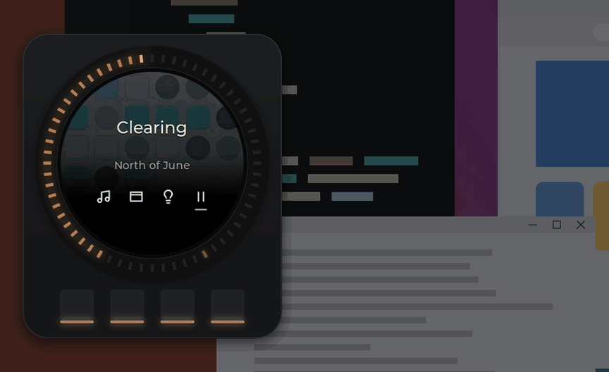</picture>

A Windows app and firmware for Karl Malota's Nano_D++. A motor makes every click, and each kind of control has its own feel.

<b><a href="#quickstart">Get started ›</a></b> &nbsp;·&nbsp; <a href="#what-you-need">What you need</a> &nbsp;·&nbsp; <a href="../../releases/latest">Download</a>

Built on Karl Malota's open Nano_D++ · Windows 10 and 11 · v2.0.0 · MIT

## What you need

- **A Nano_D++ knob** ([Karl's hardware files](https://github.com/katbinaris/Nano_D_PlusPlus)), **a Windows 10 or 11 PC** and **a USB-C cable that carries data**. Putting Desk Dial's firmware on the knob takes about half an hour, once, and you can always go back.
- **Optional:** Sonos, Apple Music and Home Assistant. Each one adds a chapter below; without any of them you still get the window picker, Onshape, the Navigator and the knob's own feel, sound and lights.
- **Apple Music browsing needs your own Apple Developer membership (99 USD a year)** and an Apple Music subscription. Everything else is free.

Not today: macOS, Linux, Spotify, lights without Home Assistant, Firefox for Onshape and the other web apps, more than one knob.

 

<b>Music</b>

<picture><source media="(prefers-color-scheme: dark)" srcset="docs/media/head-music-volume-dark.png"></picture>

Each click moves your Sonos volume 1 %, with a firm wall at each end. The top of the ring's arc glows amber past 80 % and red past 90 %.

<a href="docs/features/music.md"><picture><source srcset="docs/media/music-volume.webp" type="image/webp"></picture></a>

Needs Sonos

 

<picture><source media="(prefers-color-scheme: dark)" srcset="docs/media/head-music-albums-dark.png"></picture>

Recently Added and your favourite playlists, with covers on the knob. Press 4 to play; hold it to play next. Open Seek and the clicks give way to a smooth scrub.

<a href="docs/features/music.md"><picture><source srcset="docs/media/music-lists.webp" type="image/webp">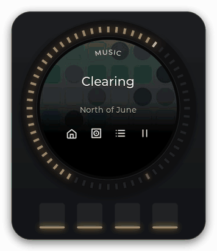</picture></a>

Needs Sonos and Apple Music (Apple Developer membership, 99 USD a year)

 

<picture><source media="(prefers-color-scheme: dark)" srcset="docs/media/head-music-explorer-dark.png"></picture>

Send the list to your monitor. The explorer and Up next fill the screen without taking focus. In Up next, Shuffle and Like are one press away.

<a href="docs/features/desktop-companions.md"><picture><source srcset="docs/media/desktop-explorer-16x9.webp" type="image/webp"></picture></a>

Needs Sonos and Apple Music &nbsp;·&nbsp; <a href="docs/features/music.md">Everything Music does ›</a>

 

<b>Lights</b>

<picture><source media="(prefers-color-scheme: dark)" srcset="docs/media/head-lights-dark.png"></picture>

For your Home Assistant lights: brightness, warmth from 2200 K to 6500 K and scenes, with a little heavier click than volume. All off remembers how the lights were, so Turn on brings them back.

<a href="docs/features/lights.md"><picture><source srcset="docs/media/lights-brightness.webp" type="image/webp"></picture></a>

Needs Home Assistant &nbsp;·&nbsp; <a href="docs/features/lights.md">Everything Lights does ›</a>

 

<b>Windows</b>

<picture><source media="(prefers-color-scheme: dark)" srcset="docs/media/head-windows-dark.png">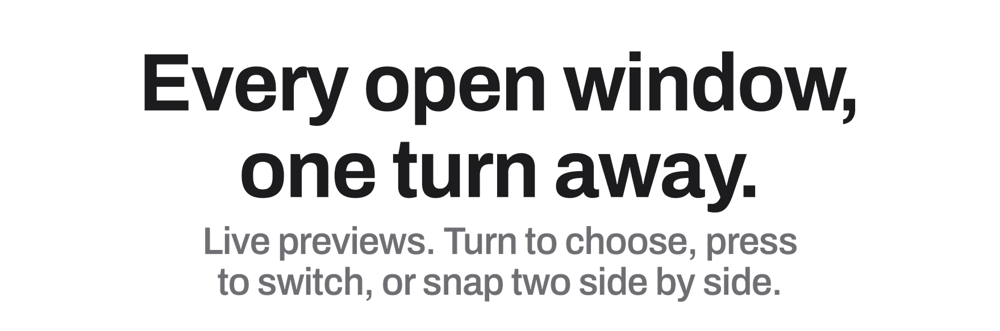</picture>

Live previews fan out. Turn to choose, press to switch, or snap two side by side, on anything from 16:9 to 32:9.

<a href="docs/features/windows.md"><picture><source srcset="docs/media/desktop-picker-16x9.webp" type="image/webp"></picture></a>

Works with nothing else set up &nbsp;·&nbsp; <a href="docs/features/windows.md">Everything the picker does ›</a>

 

<b>Onshape</b>

<picture><source media="(prefers-color-scheme: dark)" srcset="docs/media/head-onshape-dark.png"></picture>

Point at your model in Chrome or Edge. Turn to zoom; hold a button and turn to tilt, orbit or pan. Tap 3 to undo, hold 3 for Karl's command wheel.

<a href="docs/features/onshape.md"><picture><source srcset="docs/media/onshape-knob.webp" type="image/webp">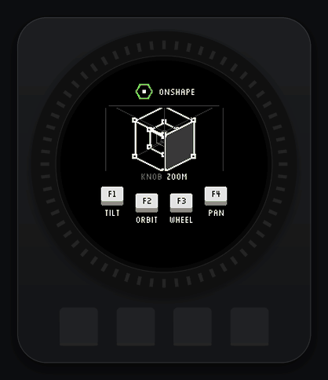</picture></a>

Chrome or Edge · turn it on in Settings › Apps &nbsp;·&nbsp; <a href="docs/features/onshape.md">Everything Onshape does ›</a>

<b>More apps</b>

<picture><source media="(prefers-color-scheme: dark)" srcset="docs/media/head-apps-dark.png">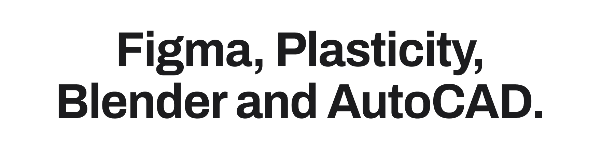</picture>

Karl Malota's app profiles give each program its own knob: what turning does, what the buttons do, and its own screen. Set an app to Auto and Desk Dial switches to it whenever the app is in front.

<a href="docs/features/apps.md"><picture><source srcset="docs/media/apps-strip.webp" type="image/webp">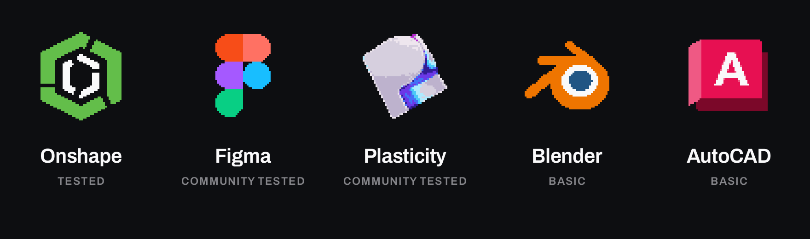</picture></a>

Figma and Plasticity community tested · Blender and AutoCAD scroll only · each Off until you choose Manual or Auto in Settings › Apps &nbsp;·&nbsp; <a href="docs/features/apps.md">Every app, and how to add one ›</a>

 

<b>The Navigator</b>

<picture><source media="(prefers-color-scheme: dark)" srcset="docs/media/head-navigator-dark.png">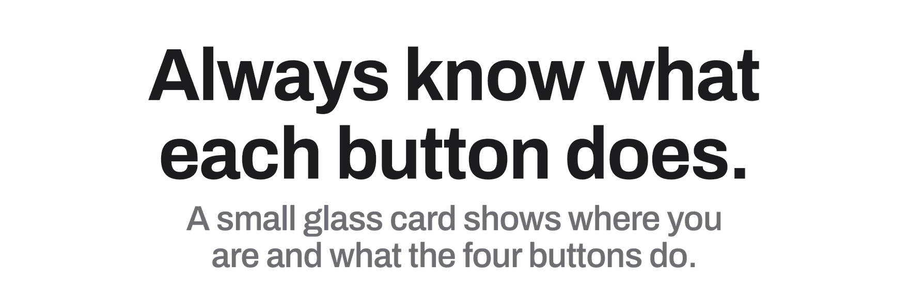</picture>

A small glass card at the edge of your screen shows where you are and what the four buttons do, then fades. It never takes focus.

<a href="docs/features/desktop-companions.md"><picture><source srcset="docs/media/navigator-cards.webp" type="image/webp">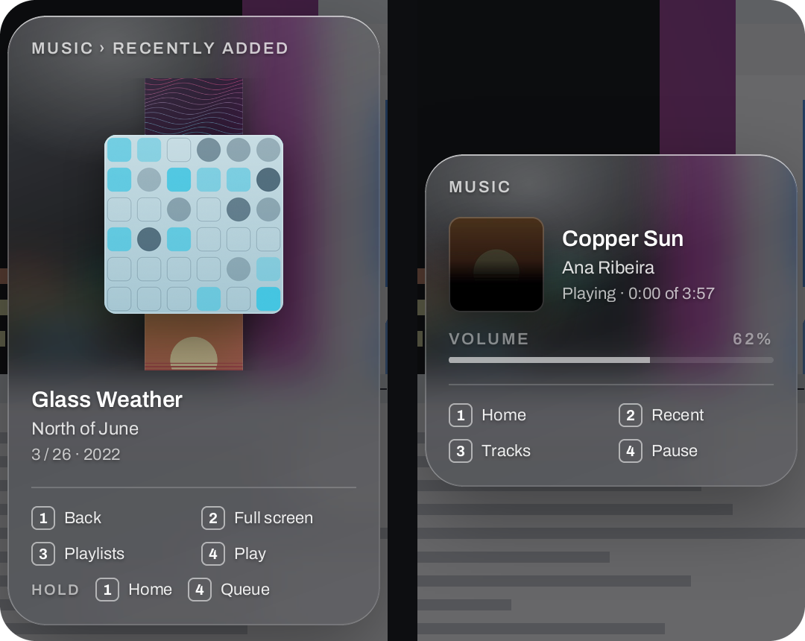</picture></a>

<a href="docs/features/desktop-companions.md">More about the Navigator ›</a>

 

<b>Feel and sound</b>

<picture><source media="(prefers-color-scheme: dark)" srcset="docs/media/head-feel-dark.png"></picture>

Soft for volume, heavier for brightness, coarse for windows, smooth for scrubbing. A tock as you turn, a thud at a wall. When you let go, the motor goes quiet.

<a href="docs/features/feel-and-sound.md"><picture><source srcset="docs/media/feel-wide.webp" type="image/webp">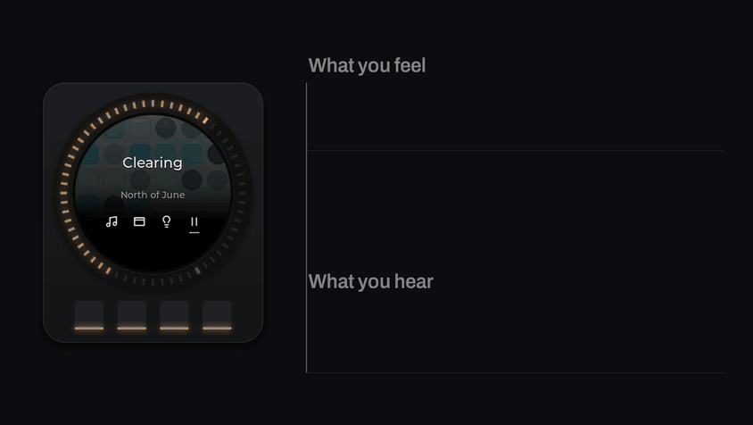</picture></a>

<a href="docs/features/feel-and-sound.md">How the feel works ›</a>

 

<b>The ring</b>

<picture><source media="(prefers-color-scheme: dark)" srcset="docs/media/head-ring-dark.png">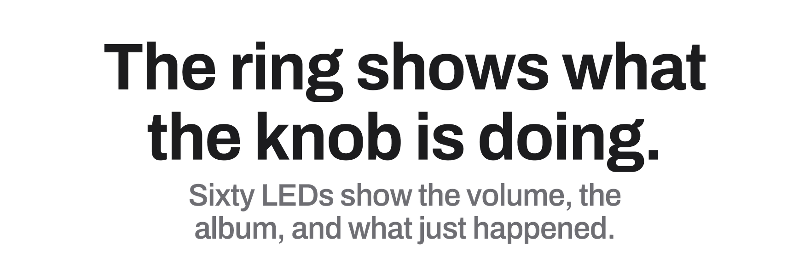</picture>

Sixty LEDs draw the volume, take on each album's colour and bloom when you press Like. At rest they settle to one steady warm glow.

<a href="docs/features/leds.md"><picture><source srcset="docs/media/ring-moments.webp" type="image/webp">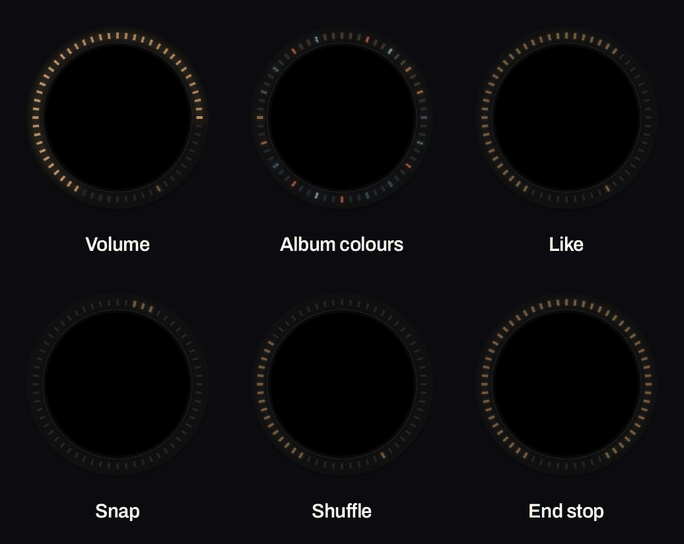</picture></a>

<a href="docs/features/leds.md">Every moment, and the screen's motion ›</a>

 

<b>Settings</b>

<picture><source media="(prefers-color-scheme: dark)" srcset="docs/media/head-settings-dark.png">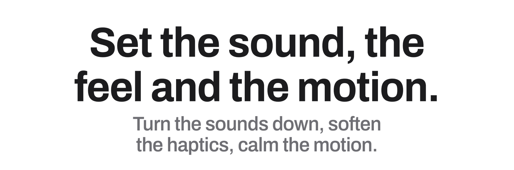</picture>

Turn the knob's sounds down or off, soften the haptics, calm the motion, and choose how the lights and the Navigator behave.

<a href="docs/features/settings.md">Every setting ›</a> &nbsp;·&nbsp; <a href="docs/features/day.md">A day with Desk Dial, in eighteen seconds ›</a>

 

<b>The knob</b>

Nano_D++ by Karl Malota: a round 240 × 240 screen, a ring of 60 LEDs, four backlit buttons, a brushless motor that makes the clicks and the walls, and a small speaker.

 

## Thank you, Karl

**Thank you, Karl.** Desk Dial exists because [Karl Malota (katbinaris)](https://github.com/katbinaris) designed the Nano_D++ and open-sourced its [firmware](https://github.com/katbinaris/NanoD_RatchetH1) and [hardware](https://github.com/katbinaris/Nano_D_PlusPlus). Desk Dial's knob firmware builds directly on his: the motor control, haptics, display and LED foundations are his and his contributors' work. With his permission, it also adapts ideas and code from his newer `feat/firmware-esp-idf-quadra` branch: the Onshape app UI on the knob (the cube, the command cards and wheel, parameter mode, the plasma and the pixel font), the click and thump sound synthesis, and the haptic-effect ideas. Desk Dial is a separate hobby project and is not an official Nano_D product.

## Small project, straight answers

- **Tested on one knob, mine.** Other knobs may need Recalibrate motor in Settings; that path and a few others are not yet tested on real hardware, and the [known limits](docs/faq.md#limits-and-known-issues) name each one.
- **The app isn't signed,** so Windows SmartScreen will warn you the first time (choose **More info**, then **Run anyway**). Smart App Control on Windows 11 can block it outright; see the [FAQ](docs/faq.md).
- **There is no installer.** Desk Dial is a folder you unzip, and nothing starts with Windows unless you set that up.

## Quickstart

**The knob in half an hour.** Each service adds a few minutes on top.

1. **Flash the knob.** Follow the [flashing guide](docs/flashing.md); it backs up Karl's firmware first. *You should see* the knob restart.
2. **Run the app.** Unzip the [latest release](../../releases/latest) anywhere and open `DeskDial.exe`; at the SmartScreen warning choose **More info**, then **Run anyway**. *You should see* the Settings window, and Desk Dial's icon in the tray.
3. **Plug in the knob.** *You should see* the tray icon read "Desk Dial · Knob connected" and the knob show Home, with four words along the bottom: Music · Win · Lights · Play (Play reads Pause while music plays).
4. **Connect what you use** in Settings: [Sonos](docs/setup/sonos.md) · [Apple Music](docs/setup/apple-music.md) · [Home Assistant](docs/setup/home-assistant.md) · [Onshape](docs/setup/onshape.md). *You should see* the matching knob screen stop saying "Not connected" or "Sonos unavailable".
5. **Turn it.** The speaker volume moves and you feel each click. Press 1 for Music; hold 1 to come back Home (in Onshape and the other apps, hold all four buttons for a second). *You should see* the screen name the four buttons on every screen, so there is nothing to memorise.

Keep the one-page [cheat sheet](docs/media/cheat-sheet.png) ([PDF](docs/cheat-sheet.pdf)) under the knob for the first week.

## Your desk stays yours

- **Nothing leaves your PC** except to the services you set up. No telemetry, no update check.
- **Your keys and tokens are encrypted** for your Windows account and never written to logs.
- **Nothing is stored on the knob.** Album covers live in memory only.

What is read, written and kept, file by file: [privacy](docs/privacy.md).

## Update, uninstall, go back

- **Update:** quit from the tray and unzip the new release over the old folder. Your settings stay.
- **Firmware:** the [flashing guide](docs/flashing.md), same steps as the first time.
- **Uninstall:** delete the folder and `%LOCALAPPDATA%\DeskDial`. Nothing was installed.
- **Go back to Karl's firmware:** the [flashing guide](docs/flashing.md) restores your backup; if the knob won't start, see [recovery](docs/recovery.md).

## Something odd?

**The tray says "Knob not found".** Try another USB-C cable (some carry power only) and another port.

**The tray says "Stock firmware · display/control extension required".** The knob still runs Karl's firmware: [flash Desk Dial's](docs/flashing.md).

**The knob says "Sonos unavailable".** Check the speaker's address in Settings › Music, and that the PC and the speaker are on the same network.

Everything else: [FAQ](docs/faq.md) · [troubleshooting](docs/troubleshooting.md) · [open an issue](../../issues) · [Karl's Discord](https://discord.gg/mVTvppcfp6).

## Built in the open

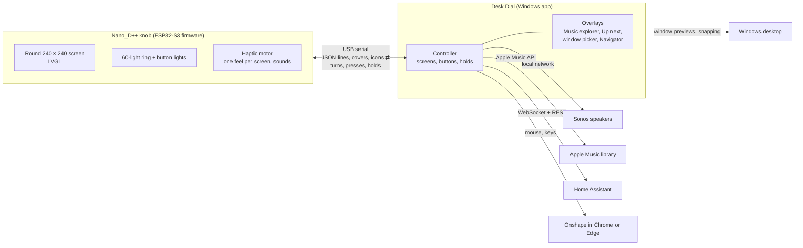

The app does the thinking and the knob does the drawing: they talk over USB in a line-based JSON protocol, documented in [firmware/CONTROL_CENTER.md](firmware/CONTROL_CENTER.md). Build the [firmware](docs/build-firmware.md) and the [app](docs/build-app.md) yourself, or add an app with a profile ([profiles/README.md](profiles/README.md)); issues and pull requests are welcome, and for a big change please open an issue first, because the knob has only four buttons to share.

## What's new in v2.0.0

Home Assistant lights and scenes, the Navigator, Onshape mode with Karl's knob UI, app profiles for Figma, Plasticity, Blender and AutoCAD, walls at every end, a silent motor at rest, screen motion and knob sounds. The knob firmware and the app now share one version number. Everything else is in the [CHANGELOG](CHANGELOG.md).

## Credits

- **[Karl Malota (katbinaris)](https://github.com/katbinaris)** designed the Nano_D++ and wrote its [firmware](https://github.com/katbinaris/NanoD_RatchetH1) and [hardware](https://github.com/katbinaris/Nano_D_PlusPlus). With his permission Desk Dial adapts, from his `feat/firmware-esp-idf-quadra` branch, the Onshape app UI on the knob (cube, cards, wheel, parameter screen, plasma, Silkscreen pixel font, icons), the click and thump sound synthesis, and the haptic effect player with its table of feels. His firmware credits [@runger](https://github.com/runger1101001) (Richard Unger).
- **App icons:** pixel art by Karl Malota ([katbinaris](https://github.com/katbinaris)), from his Nano_D app profiles.
- **Typefaces:** Archivo, Montserrat and Silkscreen, under the SIL Open Font License.
- Designed with Claude Design and built with Claude Code.
- Apple, Apple Music and MusicKit are trademarks of Apple Inc.; Sonos is a trademark of Sonos, Inc.; Windows is a trademark of Microsoft; Home Assistant is a trademark of the Open Home Foundation; Onshape is a trademark of PTC. Figma, Plasticity, Blender and AutoCAD are trademarks of their respective owners. Desk Dial is not affiliated with any of them.

Libraries

- **Firmware:** [LVGL](https://lvgl.io) 9.0.0, [TFT_eSPI](https://github.com/Bodmer/TFT_eSPI) 2.5.43, [FastLED](https://github.com/FastLED/FastLED) 3.6.0, [Simple FOC](https://simplefoc.com) 2.3.3, [SimpleFOCDrivers](https://github.com/simplefoc/Arduino-FOC-drivers) 1.0.7, [ArduinoJson](https://arduinojson.org) 7.0.2, [Adafruit TinyUSB](https://github.com/adafruit/Adafruit_TinyUSB_Arduino) 3.1.0, [AceButton](https://github.com/bxparks/AceButton) 1.10.1, [MIDI Library](https://github.com/FortySevenEffects/arduino_midi_library) 5.0.2, [SparkFun STUSB4500](https://github.com/sparkfun/SparkFun_STUSB4500_Arduino_Library) 1.1.5.
- **App:** [pySerial](https://github.com/pyserial/pyserial) 3.5, [SoCo](https://github.com/SoCo/SoCo) 0.31.2, [PyJWT](https://github.com/jpadilla/pyjwt) 2.14.0, [Pillow](https://python-pillow.org) 12.3.0, [Requests](https://requests.readthedocs.io) 2.34.2, [websocket-client](https://github.com/websocket-client/websocket-client) 1.8.0, [pystray](https://github.com/moses-palmer/pystray) 0.19.5, [PyInstaller](https://pyinstaller.org) 6.22.3.

Every image on this page is rendered from Desk Dial's own code and tools, with invented albums, rooms and windows; the torque curve is a model of the motor.

## License

[MIT](LICENSE). The knob firmware in `firmware/` builds on the Nano_D++ firmware by [Karl Malota](https://github.com/katbinaris/NanoD_RatchetH1), shared with his permission; see [NOTICE.md](NOTICE.md).
