# Desk Dial

**A haptic knob for your desk that puts Sonos, Apple Music and Windows under one dial.**

Turn it to set the volume, browse your newest albums on its round screen, skip and seek, or flip
between windows. Desk Dial is the Windows companion app and firmware that turn the
[Nano_D++](https://github.com/katbinaris/NanoD_RatchetH1) haptic knob into a music and desk controller.

  <picture>
    <source srcset="docs/media/knob-hero.webp" type="image/webp">
    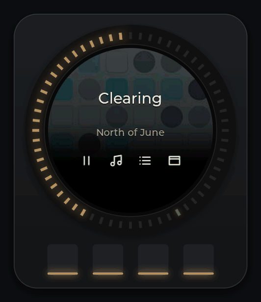
  </picture>

> **Status: early.** Windows only, Sonos and Apple Music only. See [Status](#status).

## What it does

<table>
  <tr>
    <td width="50%" valign="top">
      <picture>
        <source srcset="docs/media/knob-volume.webp" type="image/webp">
        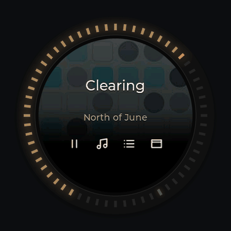
      </picture>
      <h3>Volume you can feel</h3>
      Turn for Sonos group volume, one percent per detent. The ring draws the level as a warm-white
      arc that turns <b>amber from 80 %</b> and <b>red from 90 %</b>, and the screen shows it in big digits.
    </td>
    <td width="50%" valign="top">
      <picture>
        <source srcset="docs/media/knob-browse.webp" type="image/webp">
        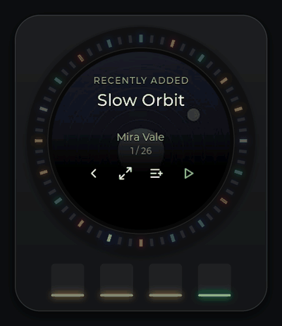
      </picture>
      <h3>Your newest music, with covers</h3>
      <b>Browse</b> shows Apple Music <i>Recently added</i> with album art on the round screen, and the
      ring lights in each album's colour. <b>Play</b> starts it on Sonos, <b>Play next</b> queues it.
    </td>
  </tr>
  <tr>
    <td width="50%" valign="top">
      <picture>
        <source srcset="docs/media/desktop-floating-knob.webp" type="image/webp">
        
      </picture>
      <h3>A knob mirror on screen</h3>
      Touch the real knob and a copy of it, screen and LEDs, slides in at the edge of your desktop.
      It is drawn at your display's refresh rate (240 Hz capable), never takes focus, and slides
      away 2.5 s after you stop.
    </td>
    <td width="50%" valign="top">
      <picture>
        <source srcset="docs/media/knob-wake.webp" type="image/webp">
        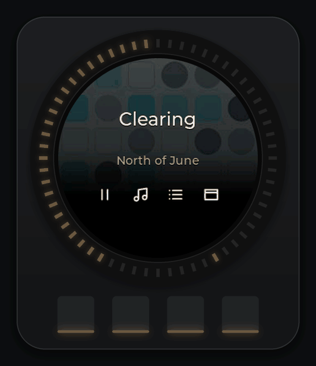
      </picture>
      <h3>"Warm · alive" lights</h3>
      At rest the ring glows a steady, dim warm white (#FF8424). Touch it and it brightens, draws what
      you are doing, and flashes an accent when something happens. Five seconds later it settles again.
    </td>
  </tr>
  <tr>
    <td colspan="2" valign="top">
      <h3>And the rest of the desk</h3>
      <ul>
        <li><b>Tracks and Seek</b>: skip, or scrub through the song in 5-second steps while the ring
            draws a lap of it.</li>
        <li><b>Haptics</b>: every mode has its own detents and end stops.</li>
        <li>Hold the first button for 600 ms to go home from anywhere.</li>
      </ul>
    </td>
  </tr>
</table>

## On your desktop

The knob drives full-screen overlays on your monitor. They never take focus, keep pace with
high-refresh displays, and lay out for 16:9 screens and 32:9 super-ultrawides.

### Music explorer

<picture>
  <source srcset="docs/media/desktop-explorer-16x9.webp" type="image/webp">
  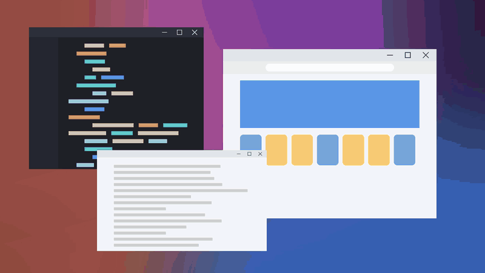
</picture>

Browse <i>Recently added</i> with the knob, switch to <i>Favourite playlists</i>, and press
<b>Play</b>: the card grows, Sonos starts it, and the overlay steps aside.

### Up next

<picture>
  <source srcset="docs/media/desktop-upnext-16x9.webp" type="image/webp">
  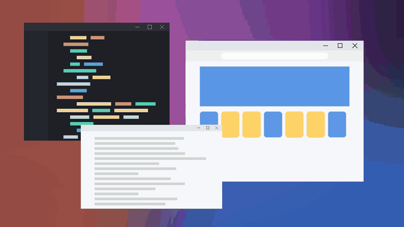
</picture>

The Sonos queue with covers: spin through it, <b>Like</b> a song, <b>Shuffle</b> what is left
(songs you added with <i>Play next</i> stay right after the current one), and <b>Play</b> any row.

### Windows picker

<picture>
  <source srcset="docs/media/desktop-picker-16x9.webp" type="image/webp">
  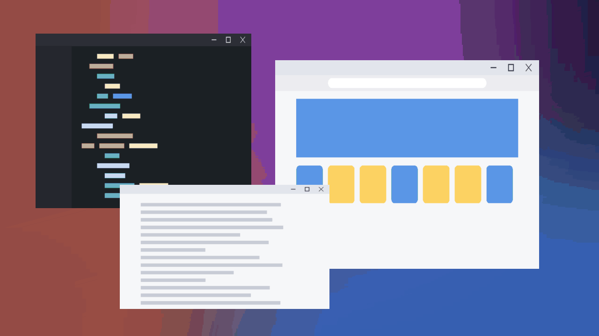
</picture>

Turn through live previews of your open windows, then <b>Switch</b>, or <b>Snap left</b> one window
and <b>Snap right</b> another to put them side by side.

### On a 32:9 ultrawide

<picture>
  <source srcset="docs/media/desktop-explorer-32x9.webp" type="image/webp">
  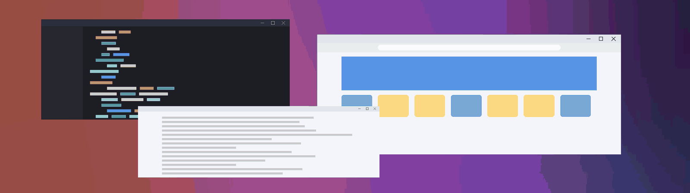
</picture>

<picture>
  <source srcset="docs/media/desktop-picker-32x9.webp" type="image/webp">
  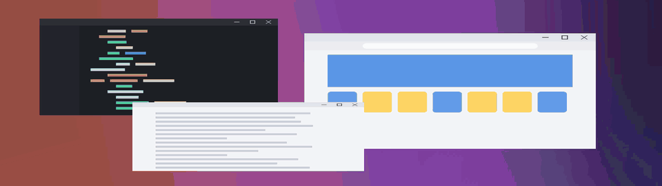
</picture>

The same explorer on a 32:9 super-ultrawide, with more of the carousel in view.

The four buttons change meaning with the mode, and the screen always shows what they do:

  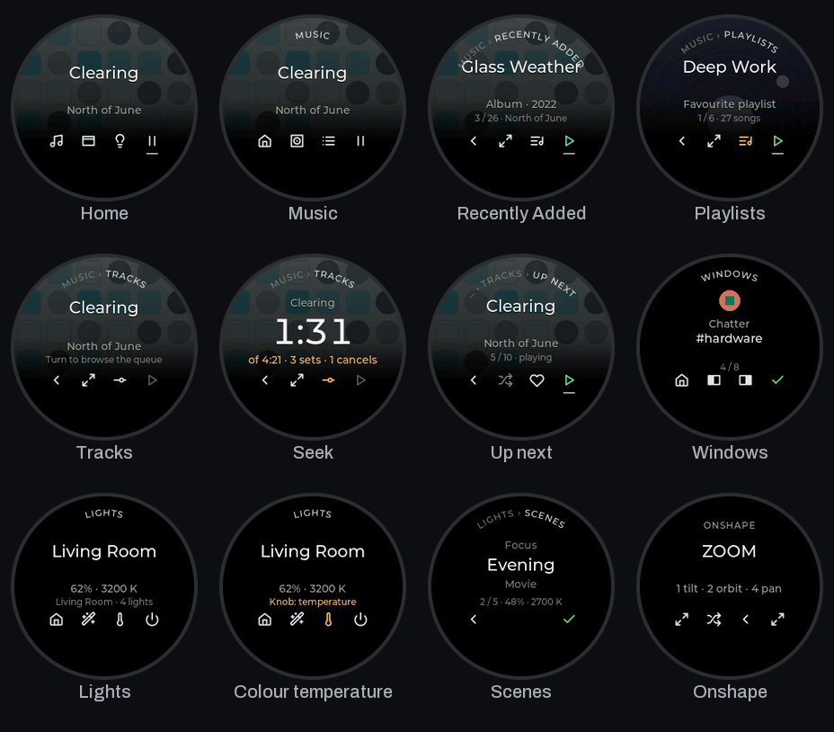

<b>More screenshots</b>: Music explorer, Up next, LED states, app icons

  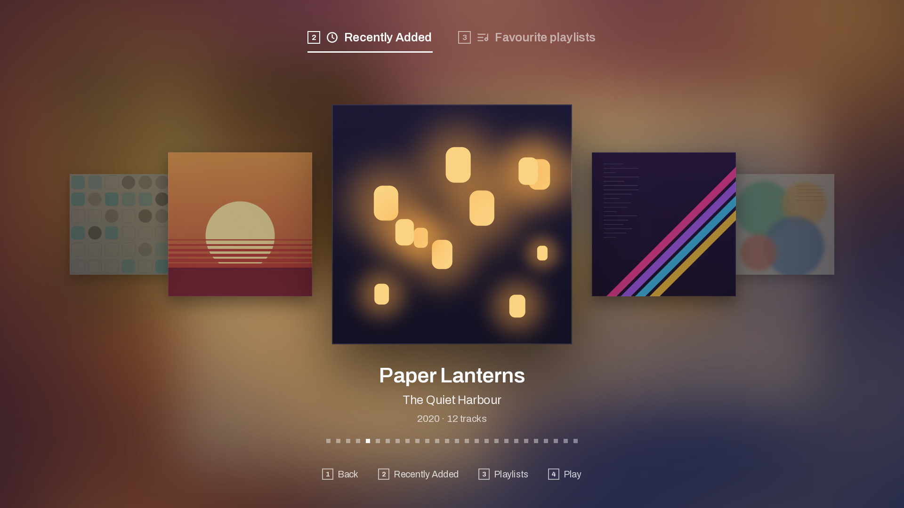
  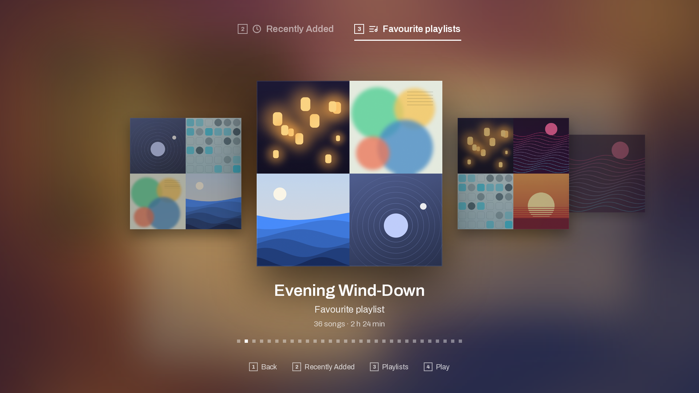
  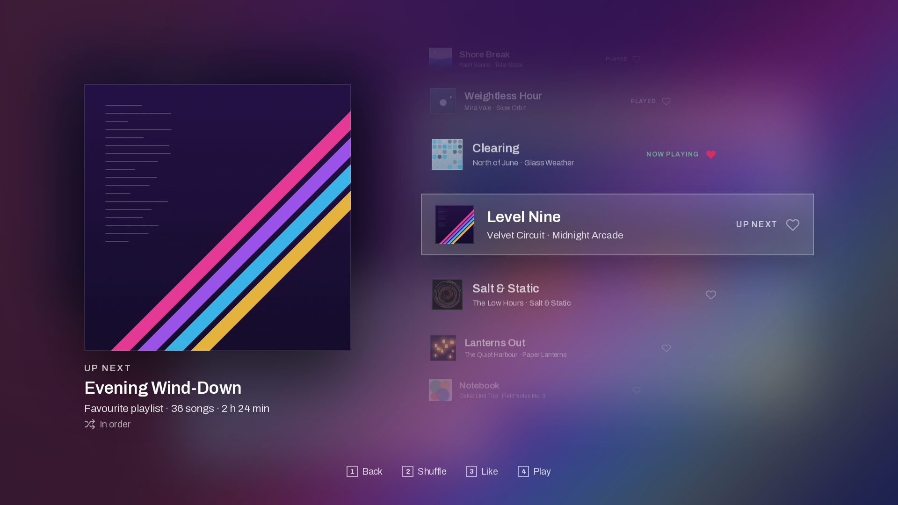

  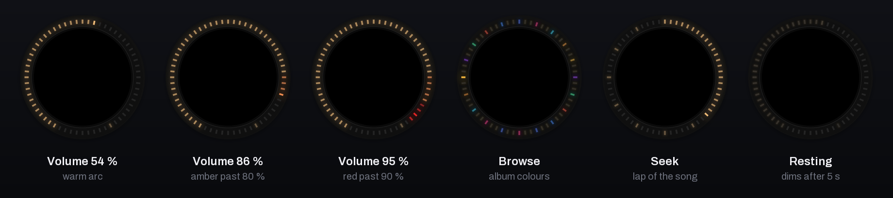

  

## How it works

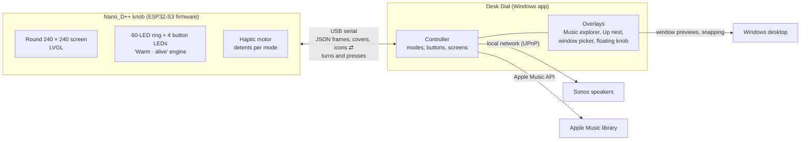

- **The app does the thinking.** It talks to Sonos and Apple Music, and for every screen change it
  sends the knob one small JSON frame: the layout, the text, the ring and the button icons.
- **The knob does the drawing.** It renders the screen with LVGL, runs the LED choreography itself
  and answers with turns and presses. Album covers travel as 240 × 240 JPEGs and are cached on the knob.
- **Nothing is stored on the knob.** When the app lets go, the knob returns to its own firmware
  interface.
- **Sonos** changes use the speakers' local interface and are confirmed by reading them back.
  **Apple Music** uses your MusicKit authorization, stored encrypted with Windows DPAPI.
- **The desktop overlays** run on the Windows compositor, so they keep up with high-refresh
  monitors. The floating knob runs the same LED engine as the knob, so both glow the same way.

## Hardware

| Part | Details |
|---|---|
| Knob | [Nano_D++](https://github.com/katbinaris/NanoD_RatchetH1) haptic knob |
| Microcontroller | ESP32-S3 |
| Screen | 240 × 240 round LCD |
| Lights | 60-LED ring around the screen, 4 button LEDs |
| Input | Haptic knob (brushless motor with detents and end stops), 4 buttons |
| Connection | USB to a Windows PC |

You also need Sonos speakers on the same network and an Apple Music subscription.

## Install

1. Download the latest **Desk Dial** zip and the **knob firmware** from the
   [Releases](../../releases) page.
2. **Flash the knob** with the script included in the firmware download. It backs up the knob's
   current firmware first, verifies the new one after flashing, and rolls back automatically if
   anything goes wrong.
3. **Unzip Desk Dial** and run its setup once: pick your Sonos speaker and authorize Apple Music.
   Then start Desk Dial. It lives in the tray and finds the knob over USB.

## Build from source

The repository is laid out like this:

| Folder | What's inside |
|---|---|
| `app/` | The Windows companion (Python). Install its requirements, run it, or package it with PyInstaller. |
| `firmware/` | The knob firmware (PlatformIO, Arduino framework). |
| `harness/` | A host harness that renders the firmware's real LVGL screens on a PC, for checks and previews. |
| `tools/` | Helper scripts, including the ones that render the images on this page. |
| `docs/` | Documentation and media. |

Each folder's README has the exact commands.

## Status

Desk Dial is early software that works day to day on one desk. Known limitations:

- **Screen animations on the knob run at about 15 fps today.** Making them smoother is being
  worked on. (The animations on this page are rendered from the firmware's renderer at 30 fps.)
- **Windows only.**
- **Sonos and Apple Music only.**

## Credits

- **[katbinaris](https://github.com/katbinaris)** designed the Nano_D++ knob and wrote its open-source
  firmware, [NanoD_RatchetH1](https://github.com/katbinaris/NanoD_RatchetH1). Desk Dial's firmware
  builds directly on it: the motor control, haptics, display and LED plumbing all come from his work.
  Thank you for making such a lovely device open.
- Firmware libraries: [LVGL](https://lvgl.io), [TFT_eSPI](https://github.com/Bodmer/TFT_eSPI),
  [FastLED](https://github.com/FastLED/FastLED), [SimpleFOC](https://simplefoc.com),
  [ArduinoJson](https://arduinojson.org), [Adafruit TinyUSB](https://github.com/adafruit/Adafruit_TinyUSB_Arduino)
  and [AceButton](https://github.com/bxparks/AceButton).
- App libraries: [SoCo](https://github.com/SoCo/SoCo), [Pillow](https://python-pillow.org),
  [pySerial](https://github.com/pyserial/pyserial), [pystray](https://github.com/moses-palmer/pystray),
  [Requests](https://requests.readthedocs.io), [PyJWT](https://github.com/jpadilla/pyjwt) and
  [PyInstaller](https://pyinstaller.org).
- Typefaces: Montserrat and Archivo, under the SIL Open Font License.
- Designed with Claude Design and built with Claude Code.

About the images: every animation and screenshot here is rendered headlessly from the project's own
code (the knob's LCD from the firmware's renderer, the lights from the LED engine, the overlays from
the app's renderers) with invented albums, artists, playlists and windows. None of it is a photo of
the device or a capture of a real desktop.

## License

[MIT](LICENSE). The knob firmware in `firmware/` builds on the Nano_D++ firmware by
[katbinaris](https://github.com/katbinaris/NanoD_RatchetH1), shared here with the author's blessing; see
[NOTICE](NOTICE) for details.
