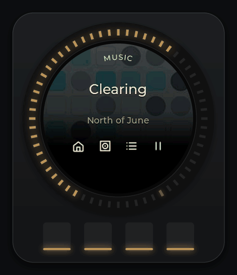
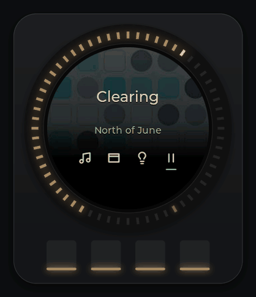
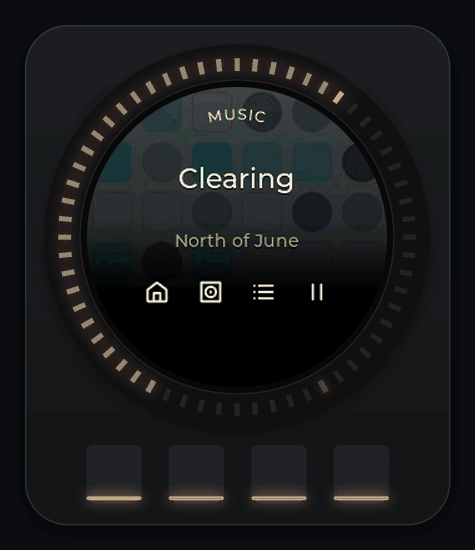
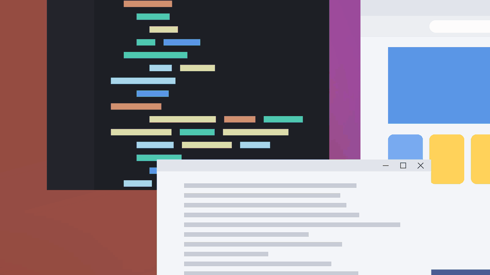
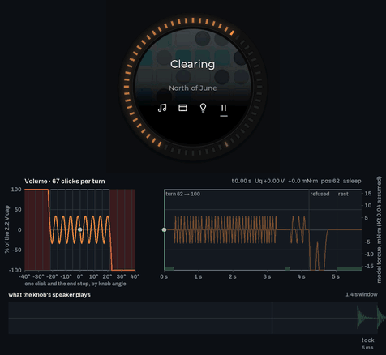
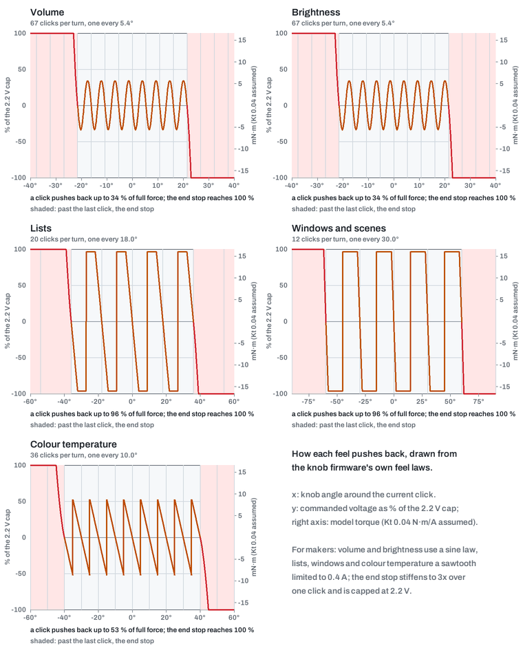
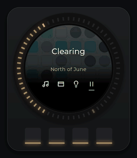
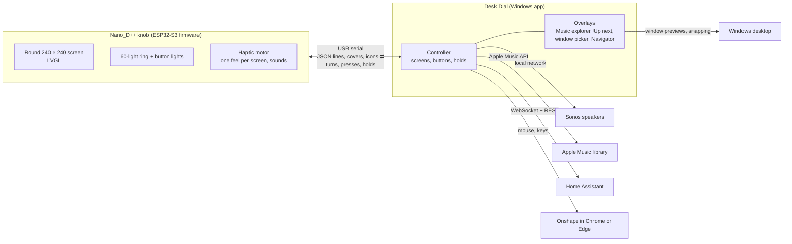

# Desk Dial

**A haptic knob for your desk that puts your speakers, your music library, your lights, your windows and your CAD model under one dial.**

  <picture><source srcset="docs/media/hero.webp" type="image/webp"></picture>

  
  
  

Windows 10 and 11 only · needs a Nano_D++ knob and a USB-C cable · tested on one knob (mine) · feedback welcome

**Contents:** [Thank you, Karl](#thank-you-karl) · [Will it work for me?](#will-it-work-for-me) · [Quickstart](#quickstart) · [Feature tour](#feature-tour) · [Feature deep dives](#feature-deep-dives) · [Setup guides](#setup-guides) · [Privacy and what it touches](#privacy-and-what-it-touches) · [Update, uninstall, go back](#update-uninstall-go-back) · [FAQ and troubleshooting](#faq-and-troubleshooting) · [For makers](#for-makers) · [What's new](#whats-new-since-the-last-release) · [Credits](#credits) · [Limits and known issues](#limits-and-known-issues) · [License](#license)

## Thank you, Karl

**Thank you, Karl.** Desk Dial exists because [Karl Malota (katbinaris)](https://github.com/katbinaris) designed the Nano_D++ and open-sourced its [firmware](https://github.com/katbinaris/NanoD_RatchetH1) and [hardware](https://github.com/katbinaris/Nano_D_PlusPlus). Desk Dial's knob firmware builds directly on his: the motor control, haptics, display and LED foundations are his and his contributors' work. With his permission, it also adapts ideas and code from his newer `feat/firmware-esp-idf-quadra` branch: the Onshape app UI on the knob (the cube, the command cards and wheel, parameter mode, the plasma and the pixel font), the click and thump sound synthesis, and the haptic-effect ideas. Desk Dial is a separate hobby project and is not an official Nano_D product.

## Will it work for me?

**You need**

- A **Nano_D++** knob, designed by Karl Malota ([hardware files](https://github.com/katbinaris/Nano_D_PlusPlus)). Desk Dial expects exactly one knob plugged in.
- A **Windows 10 or 11 PC** and a **USB-C cable** that carries data.
- Half an hour, once, to back up the knob and put the Desk Dial firmware on it (you can go back to Karl's firmware at any time).

**What each service unlocks**

| Feature | Nothing extra | Sonos | Apple Music | Home Assistant |
|---|:-:|:-:|:-:|:-:|
| Window picker: live previews, switch, snap two windows side by side | ✓ | | | |
| Onshape mode: zoom, orbit, pan, undo, command wheel (Chrome or Edge) | ✓ | | | |
| Knob feel, sounds, lights, the Navigator card | ✓ | | | |
| Speaker volume, play and pause, skip, seek | | ✓ | | |
| Up next: your speaker's queue on the knob and the PC | | ✓ | ✓ covers and Like | |
| Recently added albums and favourite playlists, Play and Play next | | ✓ | ✓ | |
| Lights: brightness, colour temperature, scenes, all off and back on | | | | ✓ |

With none of the services set up, Desk Dial is still a window picker and an Onshape controller with a good feel; the Music and Lights screens tell you what to set up.

**Costs and barriers up front**

- Sonos: nothing beyond the speakers. You type one speaker's address; Desk Dial controls the group it belongs to.
- Apple Music: an Apple Music subscription **and** an Apple Developer Program membership (99 USD per year, as of 2026-09-30) to create a MusicKit key. Without the membership there is no album browsing, no Play next and no Like; volume and the queue still work over Sonos alone.
- Home Assistant: a running Home Assistant on your network and a long-lived access token from your profile.
- Onshape: an Onshape account and Chrome or Edge.

**Not supported today**

- macOS and Linux. Spotify and other music services. Philips Hue or other lights without Home Assistant. Firefox for Onshape mode. More than one knob.

## Quickstart

1. **Back up the knob and flash Desk Dial's firmware.** Follow the [flashing guide](docs/flashing.md); it saves the knob's current firmware first so you can put Karl's back later. *You should see* the knob restart into Karl's usual screen; it changes only once Desk Dial connects.
2. **Download and unzip the app.** Get the Desk Dial zip from the [latest release](../../releases/latest), unzip it anywhere (it is portable, there is no installer) and run `DeskDial.exe`. Windows SmartScreen will say "Windows protected your PC" because the exe is not signed: click **More info**, then **Run anyway**. If Smart App Control (Windows 11) blocks it outright, see the [FAQ](docs/faq.md). *You should see* the Settings window open.
3. **First run.** Desk Dial lives in the tray; hover the icon and it reads "Desk Dial · Knob connected". Plug the knob in if you have not. *You should see* the knob's Home screen with four words along the bottom: Music · Win · Lights · Play.
4. **Connect your services (optional).** In Settings: [Sonos](docs/setup/sonos.md), [Apple Music](docs/setup/apple-music.md), [Home Assistant](docs/setup/home-assistant.md), [Onshape](docs/setup/onshape.md). Each page is a few minutes. *You should see* the matching knob screen stop saying "Not connected" or "Sonos unavailable".
5. **Try these first.** Turn the knob: the speaker volume moves one percent per click and the ring of lights follows. Press button 1 (the leftmost) for Music, then button 2 for Recent and turn through your newest albums. Hold button 1 to come straight back Home from anywhere. On Home, press button 2: the window picker opens on your monitor. *You should see* the knob's screen name the four buttons on every screen, so you never have to remember them.
6. **Get help.** Something odd? Read the [FAQ](docs/faq.md), then open an [issue](../../issues) with your Windows version and what the tray and the knob said, or ask on Karl's [Discord](https://discord.gg/mVTvppcfp6). *You should see* a reply from a human, eventually.

A **detent** is one click of the knob as you turn it. The knob's motor makes the clicks, so each screen has its own feel.

## Feature tour

### Music

<picture><source srcset="docs/media/music-volume.webp" type="image/webp"></picture>

**Volume.** On Home and in Music, turning sets your Sonos group's volume, one percent per click, with a gentle click under your fingers. The ring draws the level as a warm arc that turns amber from 80 % and red from 90 % (with "LEDs" set to Colour). Button 4 is Play/Pause on both screens.

<picture><source srcset="docs/media/music-lists.webp" type="image/webp"></picture>

**Lists.** Press 1 on Home for Music, then 2 for Recent: your newest Apple Music albums with covers, 20 clicks per turn. Button 3 toggles to your favourite playlists and back. Button 4 plays the one in focus on Sonos. The ring picks up each cover's colour.

<picture><source srcset="docs/media/music-tracks-seek.webp" type="image/webp"></picture>

**Tracks and Seek.** Button 3 in Music opens Tracks, the whole queue; turn to a song and press 4 to jump to it. Press 3 again for Seek: the knob turns into a smooth, click-free scrubber, 5 seconds per step, stopping 3 seconds before the end. Button 3 sets the position, button 1 cancels.

<picture><source srcset="docs/media/music-playpause.webp" type="image/webp"></picture>

**Play/Pause.** Button 4 on Home and in Music. Every accepted press ticks; a press the screen cannot act on gives a soft refusal instead.

<picture><source srcset="docs/media/music-hold-queue.webp" type="image/webp"></picture>

**Hold to queue.** In Recent or Playlists, hold 4 for a second: the album plays next, after the current song, with a green landing and a comet lap on the ring. In Up next, hold 4 moves the focused song to play next.

<picture><source srcset="docs/media/desktop-explorer-16x9.webp" type="image/webp"></picture>

**Music explorer and Up next on the PC.** Press 2 in Recent for Full screen: the same list fills your monitor with bigger covers, never taking focus from what you were doing. In Tracks, button 2 opens Up next: the queue with covers, Shuffle on 2, Like on 3, Play on 4. Like only adds a favourite; a liked row says "Unfavourite in Music app".

### Lights

<picture><source srcset="docs/media/lights-brightness.webp" type="image/webp"></picture>

Press 3 on Home. Turning sets the brightness of every light in your Home Assistant area, one percent per click, with a heavier click than volume. Button 3 switches the knob to colour temperature, 100 K per click from 2200 K to 6500 K with a fine 36-click turn. Button 2 opens your area's scenes (up to 20); turn and press 4 to run one. Button 4 is **All off**: it first saves how the lights were, so **Turn on** brings exactly that back. From Home, hold 4 to put brightness on the knob without leaving Home.

<picture><source srcset="docs/media/lights-scenes.webp" type="image/webp"></picture>

### Windows picker

<picture><source srcset="docs/media/desktop-picker-16x9.webp" type="image/webp"></picture>

Press 2 on Home. Live previews of your open windows fan out on the monitor of the window you were in, 12 coarse clicks per turn. Button 4 switches to the one in focus. Button 2 snaps it to the left half, button 3 to the right half; after a pair the picker closes with the two windows side by side. It closes by itself after 60 seconds untouched. A 16:9 monitor shows two cards on each side of the focus; a 32:9 super-ultrawide shows four.

On a 32:9 super-ultrawide the picker shows four previews on each side; see it on the [Windows picker page](docs/features/windows.md).

### Onshape

<picture><source srcset="docs/media/onshape-knob.webp" type="image/webp"></picture>

With Onshape mode set to Manual or Auto in Settings, point at your model in Chrome or Edge and the knob becomes a CAD controller. Turn alone to zoom. Hold 1 and turn to tilt, hold 2 to orbit, hold 4 to pan. Tap 3 for Undo; hold 3 for Karl's command wheel: Sketch, Extrude, Fillet, the views and more, each sent as Onshape's own keyboard shortcut. Hold all four buttons for a second to go Home. Auto recognises Onshape from the browser tab's title or address (cad.onshape.com and company workspaces); nothing is logged. The tilt direction and non-US keyboard layouts are not yet tested on real hardware.

### The Navigator

<picture><source srcset="docs/media/navigator.webp" type="image/webp"></picture>

Touch the knob and a compact glass card appears at the left edge of your main monitor: the path you are in, the four button words, and what a hold does (1 Home, 4 and its action). It is click-through and never takes focus. It fades 4 seconds after your last input, 20 seconds while you browse a list. Settings › General lets you pin it or turn it off. It hides while the explorer, Up next, the picker or Onshape is on screen.

### Feel and sound

<picture><source srcset="docs/media/feel-and-sound.webp" type="image/webp"></picture>

Each screen has its own feel: smooth clicks for volume, heavier for brightness, a fine 36-click turn for colour temperature, 20 per turn in lists, 12 coarse clicks for windows and scenes, and a click-free fluid scrub for Seek. Every list and value has a wall at each end; nothing wraps around. Each click has a sound from the knob's own speaker: a wooden tock, a fine click, a thud at a wall or a coarse step, a thump when a hold lands. Settings › Knob has "Knob sounds" On/Off with a volume slider (0 to 100 in steps of 5, default 100) and "Reduced haptics", which softens every step and silences the clicks while the walls still stop you. The motor goes quiet 250 ms after you let go and wakes on about one click of movement, so a resting knob is silent.

<picture><source srcset="docs/media/feel-gallery-dark.png" media="(prefers-color-scheme: dark)"></picture>

### The lights

Sixty lights around the screen plus the lights under the four buttons. At rest, 5 seconds after your last touch, the ring settles to one steady dim warm glow; it never breathes. While you work it draws what you do: the volume arc, the cover's colour in lists, a pink bloom on Like, a half-ring wash on Snap, a scatter on Shuffle, a comet lap on Queued, a glow at the wall when a turn is refused. When the PC goes away the ring drains to twelve slow amber waiting marks. Settings › Knob › LEDs: Colour, or Warm only. Every moment is animated on [the lights page](docs/features/leds.md).

### Settings

Settings opens from the tray. **Knob:** Knob sounds and Volume, Reduced haptics, Recalibrate motor (about 10 seconds, hands off; not yet tested on real hardware), LEDs, Onshape mode. **General:** Motion (Match Windows, Full, Reduced) for the screen animations, Navigator (Auto-hide, Pinned, Off). **Windows:** Switcher background (Frosted or No background). **Music:** the speaker's address, Apple Team ID, MusicKit Key ID, Choose .p8 key, Authorize Apple Music, Album artwork On/Off. **Home Assistant:** Address, Long-lived access token, Area, Test connection, Save.

<b>Motion gallery</b>: how screens slide, grow and settle on the knob

Eight short loops of the knob's screen moves (a screen pushing in, a list gliding, the stretch at a wall, a press, a landing, the Pause-to-Play morph, the hold fill, the breadcrumb cross-fade) are on [the lights and motion page](docs/features/leds.md).

Settings › General › Motion: "Match Windows" follows your Windows animation setting, "Full" always animates, "Reduced" cuts the movement.

<b>A day with Desk Dial</b>: morning to evening in eighteen seconds

<picture><source srcset="docs/media/story-day.webp" type="image/webp"></picture>

Everything in this clip is rendered from the project's code with invented albums, rooms and windows.

## Feature deep dives

One page per feature, with every button and every edge case: [Music](docs/features/music.md) · [Lights](docs/features/lights.md) · [Windows picker](docs/features/windows.md) · [Onshape](docs/features/onshape.md) · [The Navigator and the PC overlays](docs/features/desktop-companions.md) · [Feel and sound](docs/features/feel-and-sound.md) · [The lights](docs/features/leds.md) · [Settings](docs/features/settings.md).

Print the one-page [cheat sheet](docs/media/cheat-sheet.png) ([PDF](docs/cheat-sheet.pdf)) and keep it under the knob until the button words sink in.

## Setup guides

- [Sonos](docs/setup/sonos.md): type one speaker's address; Desk Dial controls its group.
- [Apple Music](docs/setup/apple-music.md): developer membership, MusicKit key, the consent page.
- [Home Assistant](docs/setup/home-assistant.md): address, long-lived access token, area, test and save.
- [Onshape](docs/setup/onshape.md): Chrome or Edge, Manual or Auto.
- [Flashing the knob](docs/flashing.md) · [Recovery](docs/recovery.md) · [Compatibility](docs/compatibility.md) · [Troubleshooting](docs/troubleshooting.md)

## Privacy and what it touches

- **Nothing leaves your PC except to the services you set up**: your Sonos speaker on your network, Apple's Music API and cover servers, and your Home Assistant. No telemetry, no update check.
- **Secrets are encrypted** with Windows DPAPI for your user account in `%LOCALAPPDATA%\DeskDial`: the MusicKit key, the Apple Music user token and the Home Assistant token. They are never written to logs or to `settings.json`.
- **`settings.json` is plain text**: the speaker address, the Home Assistant address and area, and your settings.
- **Logs** (`logs\app.log`, 1 MB × 3, `crash.log`) and a `status.json` rewritten every second hold file paths that include your Windows user name, the area and light ids, never tokens. One inventory of the knob (with its serial number) is saved per connection in `backups\` and never pruned.
- **Window titles** are read when the picker opens, shown on the knob over USB and never logged. The Onshape title and address-bar check runs on every tick, even with Onshape mode Off; it reads the host only.
- **Apple Music** is read-only except for Like (one request that adds a favourite). The developer token is signed on your PC; consent happens on a page served from 127.0.0.1 in your browser.
- **Home Assistant** over `http://` crosses your network unencrypted, and Settings warns you when the address starts with `http://`; a self-signed `https://` certificate will likely be rejected (not yet tested on real hardware). "All off" writes one scene, `scene.desk_dial_snapshot`, into your Home Assistant.
- **Nothing is stored on the knob.** Covers live in memory only.

More in [docs/privacy.md](docs/privacy.md).

## Update, uninstall, go back

- **Update the app:** quit Desk Dial from the tray, unzip the new release over the old folder (or anywhere else) and run `DeskDial.exe`. Your settings stay in `%LOCALAPPDATA%\DeskDial`. See the [CHANGELOG](CHANGELOG.md).
- **Update the firmware:** the [flashing guide](docs/flashing.md), same steps as the first time.
- **Uninstall:** quit Desk Dial, remove any start-up task or shortcut you made yourself (none is created for you), delete the unzipped folder and `%LOCALAPPDATA%\DeskDial`. There is no uninstaller because nothing was installed.
- **Go back to Karl's firmware:** the [flashing guide](docs/flashing.md) restores the backup it made. If the knob will not start, see [recovery](docs/recovery.md).

## FAQ and troubleshooting

**The tray says "Knob not found".** Try another USB-C cable (some carry power only) and another port. Desk Dial looks for exactly one Nano_D++; unplug any second one.

**The tray says "Stock firmware · display/control extension required".** The knob still runs Karl's firmware. Flash Desk Dial's: [flashing guide](docs/flashing.md).

**Button 2 on Home does nothing and the status says "F24 is unavailable".** Windows only lets the picker come to the front through a hotkey the knob sends, F24. Another app has claimed that key; close it.

**The knob says "Sonos unavailable" or Settings says "Can't reach Sonos on this network".** Check the speaker's address in Settings › Music and that the PC and the speaker are on the same network. Windows features keep working meanwhile.

**Snap says "Couldn't move …".** Windows running as administrator cannot be moved by an ordinary app. Switch to it instead.

More in [docs/faq.md](docs/faq.md).

## For makers

### How it works

The app does the thinking and the knob does the drawing. They talk over USB serial in a line-based JSON protocol: the app sends a screen (layout, text, ring, button icons, the feel) and the knob answers with turns, presses and holds; at connection the two negotiate what the knob can do (its display, its sounds, its haptic effects) so an older knob keeps working with fewer features. The protocol is documented in [firmware/CONTROL_CENTER.md](firmware/CONTROL_CENTER.md).

### Build from source

Build the firmware with [docs/build-firmware.md](docs/build-firmware.md) (PlatformIO) and the app with [docs/build-app.md](docs/build-app.md) (Python, PyInstaller). The repository: `app/` the Windows app, `firmware/` the knob firmware, `harness/` a PC renderer of the knob's real screens, `tools/` the scripts that render the media on this page, `docs/`.

### Contributing

Issues and pull requests are welcome; please use the issue templates (bug report, feature request). To add an integration, start from the Home Assistant module: one adapter with a read side and a write side, a Settings page, and a knob screen described to the controller. Open an issue before a big change so we can talk about the knob's button budget: there are only four.

Talk: [Issues](../../issues) here, or Karl's [Discord](https://discord.gg/mVTvppcfp6) for everything Nano_D.

## What's new since the last release

**v2.0.0**, upgrading from v1.1. The knob firmware and the app now share one version number and are released together.

- **Home Assistant** lights and scenes: brightness, colour temperature, scenes, all off and back on.
- **The Navigator**, a glass card on the PC that mirrors the knob's state. It replaces the floating knob of the earlier release, which is no longer shown; the tray's "Show knob" does nothing with the current firmware.
- **Onshape mode** with Karl's knob UI: the cube, the command wheel and cards, parameter mode.
- **Walls** at every end, **hold tension** and a **thump** when a hold lands, and **rest sleep**: a silent motor when you let go.
- **Screen motion** on the knob, with a Motion setting.
- **Knob sounds** with a volume slider; **Reduced haptics** and **Reduced motion**.
- **The launcher Home**: Music · Win · Lights · Play, with hold 1 as Home from everywhere.

Full list in the [CHANGELOG](CHANGELOG.md).

## Credits

- **[Karl Malota (katbinaris)](https://github.com/katbinaris)** designed the Nano_D++ and wrote its [firmware](https://github.com/katbinaris/NanoD_RatchetH1) and [hardware](https://github.com/katbinaris/Nano_D_PlusPlus). With his permission Desk Dial adapts, from his `feat/firmware-esp-idf-quadra` branch, the Onshape app UI on the knob (cube, cards, wheel, parameter screen, plasma, Silkscreen pixel font, icons), the click and thump sound synthesis, and the haptic effect player with its table of feels. His firmware credits [@runger](https://github.com/runger1101001) (Richard Unger).
- **Firmware libraries:** [LVGL](https://lvgl.io) 9.0.0, [TFT_eSPI](https://github.com/Bodmer/TFT_eSPI) 2.5.43, [FastLED](https://github.com/FastLED/FastLED) 3.6.0, [Simple FOC](https://simplefoc.com) 2.3.3, [SimpleFOCDrivers](https://github.com/simplefoc/Arduino-FOC-drivers) 1.0.7, [ArduinoJson](https://arduinojson.org) 7.0.2, [Adafruit TinyUSB](https://github.com/adafruit/Adafruit_TinyUSB_Arduino) 3.1.0, [AceButton](https://github.com/bxparks/AceButton) 1.10.1, [MIDI Library](https://github.com/FortySevenEffects/arduino_midi_library) 5.0.2, [SparkFun STUSB4500](https://github.com/sparkfun/SparkFun_STUSB4500_Arduino_Library) 1.1.5.
- **App libraries:** [pySerial](https://github.com/pyserial/pyserial) 3.5, [SoCo](https://github.com/SoCo/SoCo) 0.31.2, [PyJWT](https://github.com/jpadilla/pyjwt) 2.14.0, [Pillow](https://python-pillow.org) 12.3.0, [Requests](https://requests.readthedocs.io) 2.34.2, [websocket-client](https://github.com/websocket-client/websocket-client) 1.8.0, [pystray](https://github.com/moses-palmer/pystray) 0.19.5, [PyInstaller](https://pyinstaller.org) 6.22.3.
- **Typefaces:** Archivo, Montserrat and Silkscreen, under the SIL Open Font License.
- Designed with Claude Design and built with Claude Code.
- Apple, Apple Music and MusicKit are trademarks of Apple Inc.; Sonos is a trademark of Sonos, Inc.; Windows is a trademark of Microsoft; Home Assistant is a trademark of the Open Home Foundation; Onshape is a trademark of PTC. Desk Dial is not affiliated with any of them.

About the images: every animation and screenshot on this page is rendered from the project's own code (the knob's screen from the firmware's renderer, the lights from the LED engine, the overlays from the app's renderers) with invented albums, artists, playlists, rooms and windows. Real footage, where it appears, is marked as such.

## Limits and known issues

- Tested on one knob, mine. Other knobs may need "Recalibrate motor"; that path is not yet tested on real hardware.
- Home Assistant over `http://` sends the token unencrypted on your network (Settings warns about it); self-signed `https://` is not yet tested on real hardware.
- The exe is unsigned; Smart App Control can block it. No installer, auto-start or uninstaller ships today.
- Onshape: Chrome and Edge only; tilt direction, tool search hits and non-US keyboard layouts are unverified; shortcuts are sent as US virtual keys.
- When no app holds the knob for two seconds it is designed to send Windows volume up and down (36 clicks per turn, no end stop); not yet verified on real hardware.
- The Onshape title and address check runs even with Onshape mode Off.

## License

[MIT](LICENSE). The knob firmware in `firmware/` builds on the Nano_D++ firmware by [Karl Malota](https://github.com/katbinaris/NanoD_RatchetH1), shared with his permission; see [NOTICE.md](NOTICE.md).
