# Desk Dial

A haptic knob for your desk that puts Sonos, Apple Music and Windows under one dial.

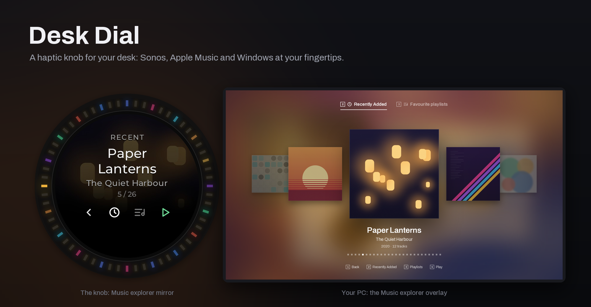

> **Status: in development.** This repository holds the README and screenshots for now. The source code
> (knob firmware and Windows companion) will be published here later. See [Status](#status).

## What it is

Desk Dial is a USB haptic knob plus a Windows companion app.

- **The knob** has a round 240 × 240 screen inside a ring of 60 LEDs, four backlit buttons below the
  dial, and a motor that gives each mode its own detents and end stops.
- **The companion app** runs on the PC and does the thinking. It talks to your Sonos speakers and your
  Apple Music library, draws full-screen overlays on your monitor, and tells the knob what to show,
  how to light up and how to feel.

The app has no main window. It lives in the tray, and a floating copy of the knob slides in on screen
whenever you touch the real one.

## What it does

The four buttons change meaning with the mode, and the screen always shows their icons. Holding the
leftmost button for 600 ms returns to Home from anywhere.

  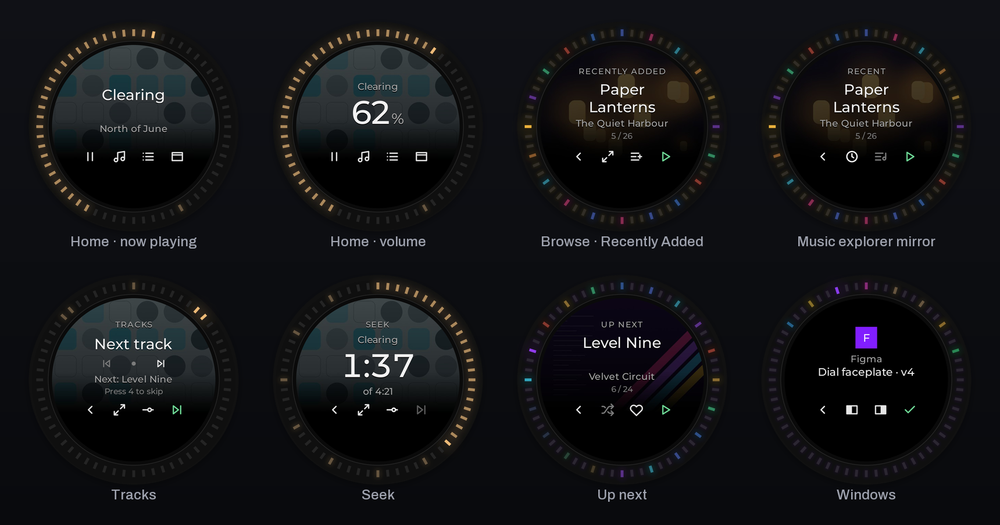

### Home: volume and Play/Pause

- Turn to set the Sonos group volume, one percent per detent. The screen shows the song and artist
  over the album cover, and turning reveals the volume in large digits.
- The ring draws the volume as a warm arc. It turns amber past 80 % and red past 90 %.
- Buttons: **Play/Pause** · **Browse** · **Tracks** · **Win**.

### Browse music: Recently Added and Favourite playlists

- **Browse** lists your Apple Music *Recently Added* items on the knob, in Apple's order. Each item
  lights the ring in its album's colour.
- **Open** expands the list into the **Music explorer**, a full-screen cover carousel with two tabs:
  *Recently Added* and *Favourite playlists*. Playlists show a mosaic of their album covers. The
  knob mirrors the focused item.
- **Play** replaces the Sonos queue with the whole album or playlist. **Play next** queues it right
  after the current song.

  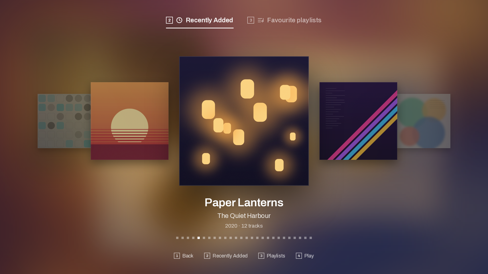
  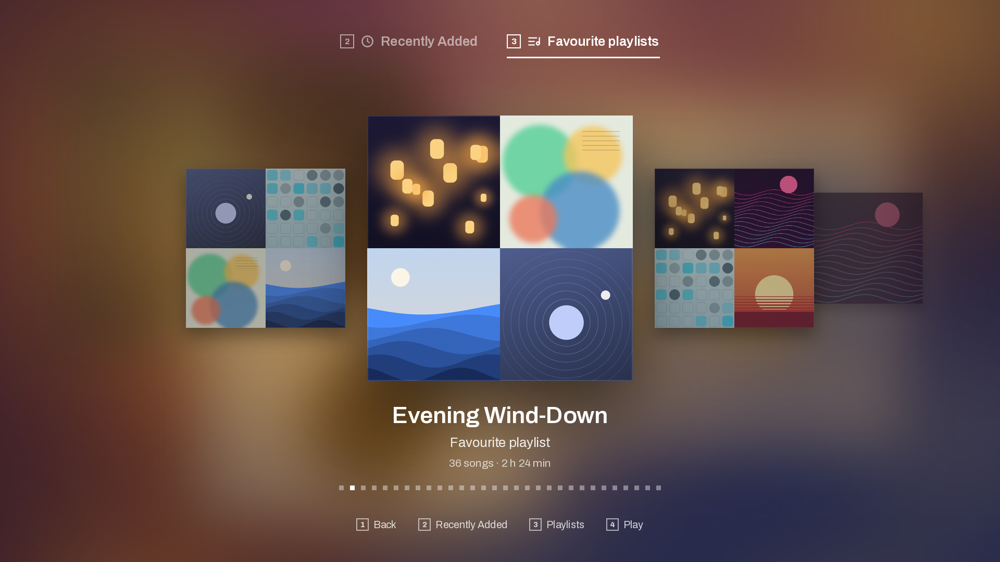

### Tracks and Seek

- **Tracks**: turn to choose Previous or Next, then press to skip. The screen names the neighbouring
  song.
- **Seek**: turn to move through the current song in 5-second steps. The time shows in large digits,
  the ring draws a lap of the song, and the jump is sent once you stop turning.

### Up next, with Shuffle and Like

- A full-screen view of the Sonos queue: what has played, what is playing now and what comes next,
  each row with its cover. Turn to move through it; **Play** jumps to that song.
- **Shuffle** reorders what is left. Songs you added with *Play next* stay right after the current
  song. Very long queues are shuffled by Sonos itself.
- **Like** adds the focused song to your Apple Music favourites. It only adds; unfavouriting stays
  in the Music app.

  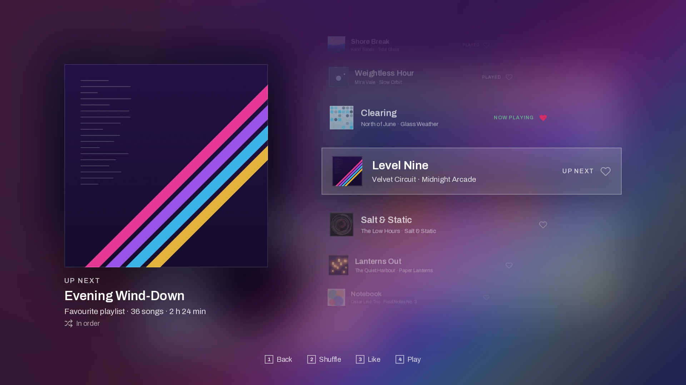

### Windows picker, with Snap

- **Win** opens a carousel of live window previews on the monitor you are working on. Turn to pick a
  window; **Switch** brings it to the front.
- **Snap left** and **Snap right** place the chosen window on that half of the screen. Pick a second
  window for the other half.
- **Back** cancels and returns you to the window you were in. The background is either *Frosted*
  (a blurred snapshot of the desktop) or the desktop dimmed.

  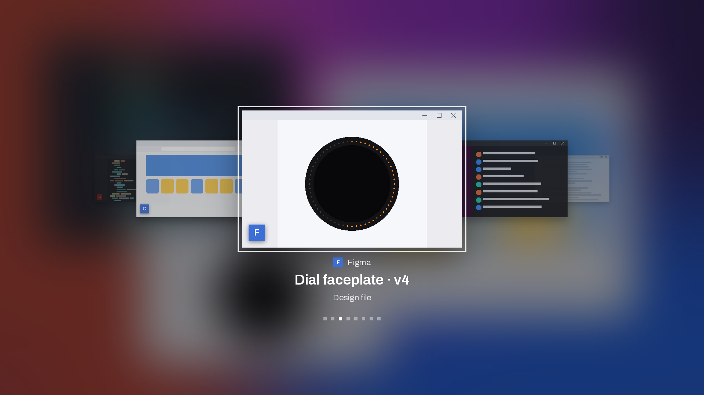
  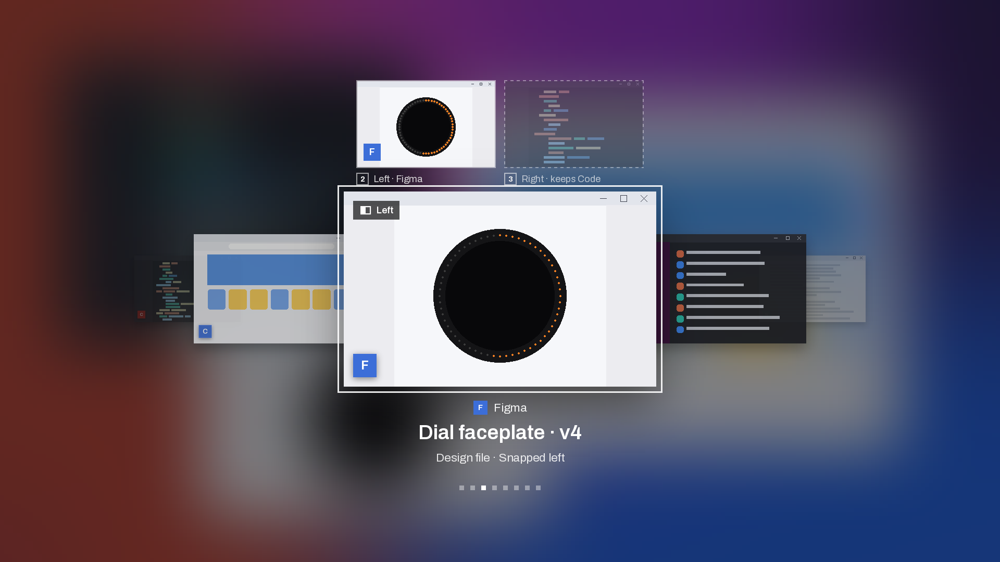

### Floating knob

- A copy of the knob, screen and LED ring, floats at the left edge of the primary screen. It slides
  in when you turn or press the physical knob and slides out 2.5 s after the last touch. It never
  takes the focus, and clicks pass through it.
- It is drawn at the screen's own resolution from higher-resolution covers and icons, not scaled up
  from the knob's 240 px.

  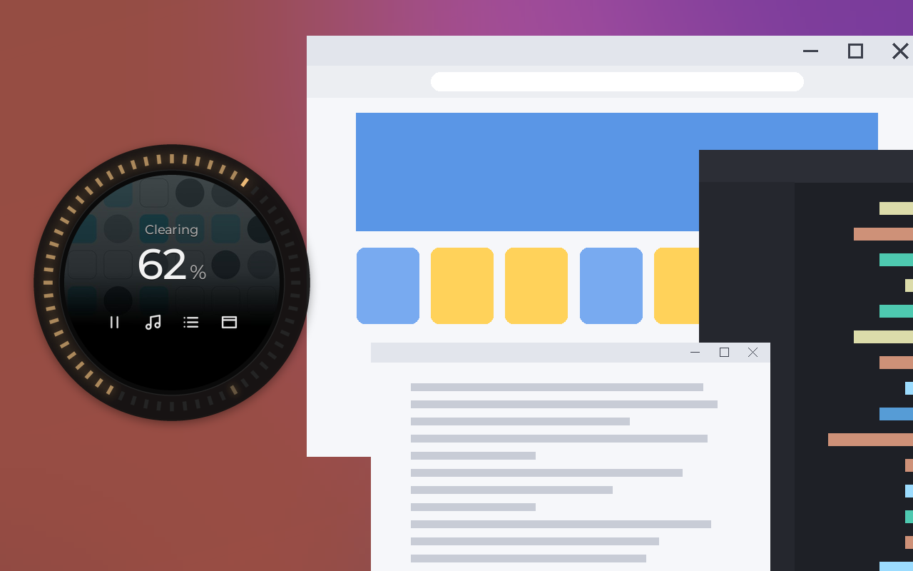

The tray icon follows the taskbar's light or dark theme and shows whether the knob is connected.

  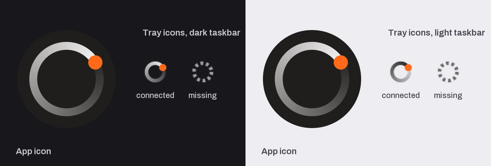

### "Warm · alive" LED choreography

- The knob renders its ring and button lights itself: a warm palette, a breathing idle, feedback for
  presses, flares at end stops and six glow looks.
- Lists light up in album or app colours, volume turns amber and then red near the top, Seek draws a
  lap of the song, and a Like blooms pink.
- After 5 s without a touch the ring rests at a low level, and its resting brightness follows the
  time of day.
- The floating knob runs the same LED engine as the knob, so both show the same lights.

  

### Smooth overlays on high-refresh displays

- The Music explorer and Up next are drawn by the app's own DirectComposition compositor. Their
  animations run on the Windows compositor rather than in Python, so they keep pace with
  high-refresh monitors. The target is 240 Hz.
- They lay out for 16:9 screens and for 32:9 super-ultrawides.
- The overlays never take the focus. They close on Back, on a 600 ms hold, after 60 s without knob
  input, and when the PC locks or sleeps.

  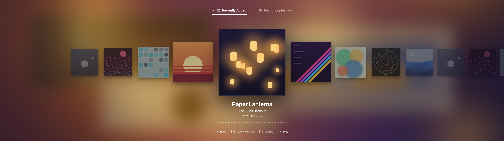
  

## How it works

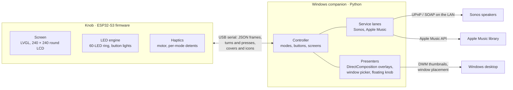

- **Knob ↔ companion.** While the companion holds the knob, it leases it over USB serial with
  newline-delimited JSON. For each mode it installs runtime-only detent bounds. It then sends one
  frame per screen change, with the layout, text, ring and button icons, and the knob answers with
  tagged turns and presses. Nothing is saved on the knob. When the app lets go, or stops renewing
  its lease, the knob goes back to its own interface.
- **Artwork.** Album covers go to the knob as 240 × 240 JPEGs and app icons as 32 × 32 bitmaps. They
  are sent in chunks and cached in the knob's PSRAM.
- **Lights.** The LED choreography runs on the knob, driven by the frames. The companion runs a
  Python twin of the same engine to draw the floating knob.
- **Sonos.** Volume, transport, seek and queue changes use the speakers' local UPnP/SOAP interface,
  one call at a time, and each change is confirmed by reading the state back.
- **Apple Music.** Recently Added, favourite playlists, catalog lookups and Like use the Apple Music
  API with your MusicKit authorization, which is stored encrypted with Windows DPAPI. Playing
  something builds the Sonos queue from the matching Apple Music songs.
- **Windows.** Window previews are live DWM thumbnails, and Snap places windows in the halves of
  the monitor's work area.
- **Overlays.** The Music explorer and Up next run on a DirectComposition stage on their own
  thread, and the floating knob is a click-through layered window.

## Hardware

| Part | Details |
|---|---|
| Microcontroller | ESP32-S3 |
| Screen | 240 × 240 round LCD (GC9A01) |
| Lights | 60 addressable RGB LEDs around the screen, plus LED-backlit buttons |
| Buttons | Four, below the dial |
| Haptics | Motor with field-oriented control for detents and end stops |
| Connection | USB (serial) to the PC |

**Software stack.** The firmware is built with PlatformIO on the Arduino framework, with LVGL 9,
TFT_eSPI, SimpleFOC, ArduinoJson and TinyUSB. The companion is Python for Windows, using SoCo,
Pillow, pySerial and pystray, and is packaged with PyInstaller. A host harness renders the
firmware's actual LVGL screens on the PC, and a headless test suite with golden images covers the
companion.

## About the screenshots

Every image here is a headless render from the project's own renderers, with fictional sample data:

- **Knob screens.** The companion's firmware-parity LCD mirror, the same renderer the floating knob
  uses.
- **LED rings.** The "Warm · alive" engine settled on each frame.
- **Overlays.** The reference renderer of the DirectComposition scenes.
- **Windows picker.** The production carousel on a test backend.

The albums, artists, playlists and window titles are invented. The covers are drawn procedurally, and
the windows and wallpaper are synthetic. None of these images is a photo of the device or a capture
of a real desktop.

## Status

Desk Dial is in active development:

- The "Warm · alive" release (firmware and desktop app) is being finished.
- The project is being renamed from its dev-kit name to Desk Dial.

The code will be published in this repository after a privacy review and a license check of the
dev-kit firmware it builds on. The license will be decided when the code is published, so there is
no license file yet.

## Acknowledgements

- Built on the **Nano_D++** haptic knob dev kit and its open-source firmware,
  [NanoD_RatchetH1](https://github.com/katbinaris/NanoD_RatchetH1).
- Designs made with **Claude Design**.
- Built with **Claude Code**.
- The screens use the Montserrat and Archivo typefaces, under the SIL Open Font License.
