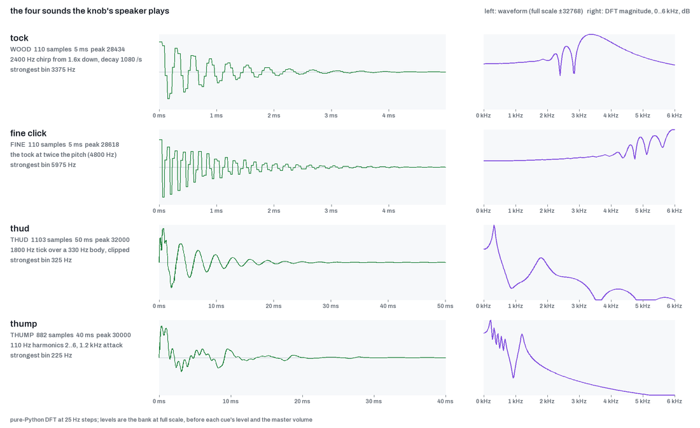

# Feel and sound

Desk Dial turns a knob with a motor inside into something that feels different on every screen. The motor makes the clicks you feel, the end stops that push back, the tension when you hold a button, and the small knock when a hold lands. A tiny speaker inside the knob gives each of those a sound. This page describes what you feel and hear, what each sound means, and the settings that change it.

The knob is a Nano_D++ by Karl Malota running Desk Dial's firmware ({{RELEASE}}). Everything here is tested on one knob (the author's).

<picture><source srcset="../media/feel-and-sound.webp" type="image/webp"></picture>

## What a detent is

A detent is one click of the knob. There is no mechanical ratchet inside: the motor holds the shaft in a small "well" and lets it fall into the next one as you turn. Because the wells are made by software, the knob can have 67 of them on one screen and 12 on another, and the walls at the ends can move with the list you are scrolling.

The firmware is Desk Dial's firmware for the Nano_D++; the feel for each screen comes from the Desk Dial app on your PC and is applied the moment the screen changes.

## The five feels

Each screen asks for one of five feels. A sixth, free spin, is a variant of the list feel.

| Feel | Where | Clicks per turn | What it is like |
|---|---|---|---|
| Smooth clicks | Volume (Home) | 67 | Soft, rounded steps. The same strength as Karl's stock firmware at Home, so volume feels familiar. A fast spin coasts freely. |
| Heavier clicks | Lights brightness (Lights, or Home after hold 4) | 67 | The same steps as volume with four times the damping, so the knob feels heavier under your hand. |
| Light clicks | Recently Added, Playlists, Tracks, Up next | 20 | Sharper, closer steps for stepping through a list. One click is one item. |
| Coarse clicks | The Windows picker, Scenes | 12 | Wide, firm rotary steps, almost twice as stiff as the list feel. One click is one window or one scene. |
| Fine clicks | Colour temperature (Lights after tap 3) | 36 | Small, light steps with a higher-pitched click. One click is 100 K. |
| Smooth scrub | Seek (Tracks, tap 3) | none | No clicks at all, only a fluid drag. Each 5 s step still makes a quiet click sound. |

Free spin: a Recently Added or Playlists list longer than 20 items uses the list feel but lets the knob coast when you spin it fast, so a long list is quick to cross.

Onshape uses the smooth clicks to zoom and a light fluid drag while a modifier button is held (tilt, orbit, pan). See [Onshape](onshape.md).

<picture><source srcset="../media/feel-gallery-dark.png" media="(prefers-color-scheme: dark)"></picture>

### How to read the gallery

Each panel plots the motor's push against the knob's angle around one click. The vertical axis is the motor command as a share of its 2.2 V cap, which is what the firmware actually controls; the mN·m scale beside it is a model, computed with an assumed motor constant of 0.04 N·m/A, not a measurement of the real knob.

## Walls at every end

Every value has an end: 0 % and 100 % volume, the first and last item in a list, 2200 K and 6500 K. Nothing wraps round. Past the last click the knob becomes a wall: a spring that starts as stiff as the click you just left and gets three times stiffer over the width of one click, capped at the motor's full strength. The further you push, the harder it pushes back, and it springs you back onto the last click when you let go.

Each refused click at a wall does three things at once:

- the motor pushes back (the wall itself);
- the knob makes a low thud;
- the screen stretches 9 px towards the wall and bounces back, and the five LEDs at that end of the ring glow warm white for half a second (see [LEDs](leds.md)).

A wall never clicks and never counts as a step. Holding the knob against a wall for a long time slowly eases the force (see "Safety limits under test" below).

## Holding a button

Two holds have a secondary action: hold 1 (600 ms) goes Home from any screen below Home, and hold 4 (1000 ms) runs the screen's hold action (Queue in Recently Added, Play next in Up next, the brightness swap on Home). While you hold, the knob gets progressively harder to turn in four steps, one every quarter of the hold, so you can feel the hold maturing without looking. Let go early and the tension simply drops with no event. Both buttons act on release for a tap, so a hold is never also a tap.

When the hold lands, the knob gives a double knock, the landing thump, and the ring and screen show their landing (the fill, the pop, the sweep).

Onshape has no holds of this kind: there, hold 1, 2 and 4 are modifiers and Home is all four buttons held for 1 s.

## Confirmations, nudges and refusals

Every press you make gets a reply through the motor and the speaker:

| What happened | What you feel | What you hear |
|---|---|---|
| Any accepted press (open a list, Back, Home, Play or Pause, switch source) | one short tick | a wooden tock |
| A hold lands; Play from a list; Queue or Play next; Turn on; Scene run | two strong pulses 12 ms apart (the thump) | a low thump |
| All off (Lights) | one firmer pulse | a softer thump |
| Skip to a track, snap a window left or right | one pulse that leans the way you went (a nudge) | a thud |
| A button that is not available right now | three quick pulses 30 ms apart (the buzz), at most once a second | three quiet tocks |
| Something failed on the PC or the network | three strong pulses 70 ms apart | three thuds |

A refused press also shows its reason on the knob's screen in red for 2 s and lights the bottom of the ring red for half a second. The knob never shakes or jolts: a pulse is one full sine wave over 4 ms with a short tail, so a resting knob does not get thrown off its click.

## Rest sleep

A knob with a motor can hum faintly at rest, because the motor keeps answering the tiny noise of its position sensor. Desk Dial's firmware puts the motor to sleep instead: 250 ms after you let go, with the knob sitting still on a click, the motor goes silent and the knob is free. It wakes the moment you turn it about one click (never less than 2.5 degrees, so a touch does not wake it), when a screen change moves the clicks under it, or when anything plays (a tick, a thump, a hold). On waking, the clicks ease back in over about a tenth of a second rather than snapping on.

Resting against a wall is rest too: the wall pushes nothing until you move the knob about one click into it, then it fades in.

## The two deeper sleeps

Rest sleep is about the motor. The knob as a whole also sleeps:

- After 10 minutes without a press or a turn, the screen dims to about 20 %. The LEDs and the motor stay as they are. Any press or turn restores it and acts normally.
- After 60 minutes, the screen and every LED go off and the motor driver is switched off completely.

From the deep sleep, the first press or the first 2° of turn only wakes the knob. That input is swallowed: a press that wakes it does not open anything, and the turn that wakes it does not change the value. The motor comes back once the knob has been still for a moment and re-anchors its clicks where it finds the shaft, so the value never jumps. Messages from the PC never wake the knob and never reset the timers; only your hand does.

## The four sounds

The knob has four sounds, each built from a short synthesised tone when the knob starts up. Every sound follows a haptic: if the motor does not play a pulse, the speaker says nothing.

<picture><source srcset="../media/sound-bank-dark.png" media="(prefers-color-scheme: dark)"></picture>

| Sound | Length | When |
|---|---|---|
| Tock | 5 ms | every click of the volume, brightness and list feels; every accepted press; the refusal buzz (three quiet ones) |
| Fine click | 5 ms, an octave higher | every click of the colour-temperature feel; every counted step of the Seek scrub and the Onshape drags |
| Thud | 50 ms | every click of the coarse feel (Windows, Scenes); every refused click at a wall; a nudge; the error buzz (three) |
| Thump | 40 ms | the landing of a hold; Play, Queue and Play next from a list; Turn on and Scene run; a softer one for All off |

The sound strip in the gallery shows each sound as the speaker plays it: a wooden chirp dropping in pitch for the tock, the same an octave up for the fine click, a high tick over a low body for the thud, and a low knock built from the harmonics of 110 Hz for the thump. The low fundamentals were tuned by ear to what the knob's small speaker can actually reproduce, so the shapes differ from Karl's originals.

Nothing sounds while the knob is coasting in a fast spin, and nothing sounds with Reduced haptics on.

## Settings

All of these live in Desk Dial Settings on your PC (right-click the tray icon). They apply at once and are sent to the knob with each screen; nothing is stored on the knob.

**Knob sounds · Volume** (Settings › Knob). On or Off, with a volume slider from 0 to 100 % in steps of 5. The default is On at 100 %, where the thump plays at full scale and the quieter sounds keep their ratios to it.

**Reduced haptics** (Settings › Knob, default Off). For a quieter, gentler knob:

- volume and brightness lose their clicks and become a smooth, damped turn;
- lists, coarse and fine keep soft rounded steps but without the sharp pulse, and silent;
- every event is one soft pulse instead of a thump or a buzz, with one sound each;
- the hold tension is off;
- the walls stay, but without the thud.

The note under these settings reads: "Every turn, wall and press has a sound and a haptic; the volume sets how loud. Reduced haptics: softer steps, one pulse instead of a thump or buzz; the ends still stop the knob."

**Motion** (Settings › General): Match Windows, Full or Reduced. Match Windows follows the Windows "Animation effects" switch. Reduced reaches the knob too: the screen replaces its moves with 160 ms fades and the ring drops its decorative effects. The eight screen moments and what Reduced does to each are listed on the [LEDs](leds.md) page.

**Recalibrate motor** (Settings › Knob). Re-aligns the motor's sensor, about 10 s with your hands off the knob; the screens come back when it is done. The knob refuses to recalibrate while a screen is active, so the app first releases it. If the run finds the motor direction has changed, it stops and asks once more; pressing the button again accepts the new direction. Not yet tested on real hardware.

## Safety limits under test

Two protections are in the current firmware. Both were tuned against a model of the knob, not on the real one.

**Wall fold-back.** Leaning hard against a wall for a long time heats the motor. The firmware keeps a running budget of the wall's effort; after roughly half a minute of a full-strength lean the wall force eases, over about a second, to half, and stays there while you keep leaning. It recovers within a few seconds of letting go. The numbers are provisional, to be calibrated by a three-minute lean test on the knob. Model-tested only.

**Spin trip.** If the motor's direction were ever wrong (a bad calibration), a wall or a scrub could drive the knob to spin by itself. The firmware watches for "fast for too long": faster than about 2.4 turns a second for 2 s straight, and cuts the motor until you press a button or the screen changes. A hard flick, a long fast list scroll or a push through a wall do not trip it in the model. If you spin the knob that fast yourself for 2 s, it also trips and goes limp until a press. Model-tested only.

## Limits and known issues

- The feel per screen, the walls, the sounds and rest sleep have been checked by hand on one knob. The fold-back and the spin trip have only been tested in a model (above).
- Recalibrate motor has not yet been tested on real hardware.
- With Karl's stock firmware, or with an older Desk Dial, the knob keeps the stock feel and makes no sound. The per-screen feels, the sounds and the pulses are only sent to a knob whose firmware reports that it supports them; see the [compatibility table](../compatibility.md) and the [firmware protocol](../../firmware/CONTROL_CENTER.md).
- The tock is deliberately quiet at the default volume; the thump is the loudest sound. If you hear nothing at all, check Knob sounds is On and the volume is above 0.
- The model behind the gallery assumes a motor constant, a rotor inertia and a friction value (none of them measured), so the mN·m scale is indicative only.
- The speaker's clock runs whenever the firmware is running, as it did in every earlier firmware. Whether that produces an audible idle hiss is on the hands-on checklist and not yet confirmed; it would not depend on the Knob sounds setting.
- The spin trip will also stop the motor if you spin the knob yourself faster than 2.4 turns a second for 2 s. A press brings it back; if the knob stays limp, see [recovery](../recovery.md).
