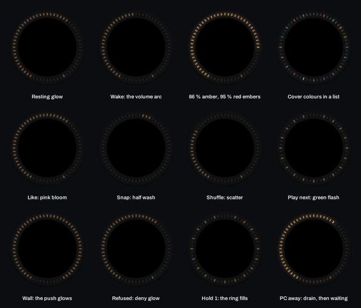
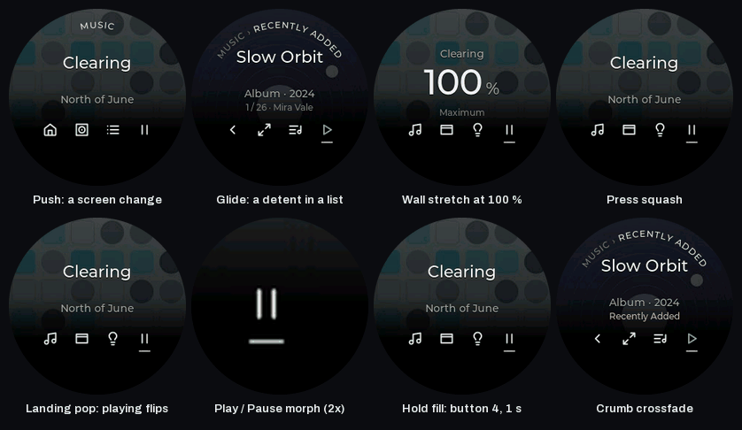

# LEDs and motion

The knob has a ring of 60 LEDs under its rim and two LEDs under each of the four buttons. Desk Dial uses them as a second display you can read without looking at the screen: how loud, where you are in a list, which window is next, whether a hold is about to land. This page describes what the ring shows at rest, what it shows while you use it, the short "moments" it plays on an action, and what the Motion and LEDs settings change. The last section covers the screen's own motion, which the same setting controls.

Everything here is from the current firmware ({{RELEASE}}) and is tested on one knob (the author's).

<picture><source srcset="../media/leds-moments.webp" type="image/webp"></picture>

## The steady warm rest

Five seconds after your last press or turn the ring settles into one steady, dim, warm white. It does not breathe or pulse. Its brightness follows the time of day a little (dimmer at night) but never below 80 % of its daytime level, because dimmer than that the LEDs can no longer show the warm hue and drift towards green. For the same reason, segments the design would have shown very dim (the empty part of a brightness arc, the scenes you have not selected) are simply off rather than faint.

When the knob has slept for 60 minutes every LED goes off with the screen; see [Feel and sound](feel-and-sound.md) for the sleep rules.

## What the ring shows while you use it

**Volume (Home).** A warm arc from the bottom left that fills clockwise with the volume. From 80 % the filled segments turn amber, from 90 % red, and above 90 % the red segments flicker slowly like embers while you are on Home. The amber and red appear only with LEDs set to Colour; with Warm only the arc stays warm white all the way up.

**Lists (Recently Added, Playlists, Tracks, Up next).** Each item is three segments wide. With LEDs set to Colour, the ring takes the colour of each item's album cover (a saturated version of it, so it reads on the LEDs); covers too grey to read, and items with no cover, show warm white. The selected item is brightest. While you browse, a faint tint of the selected cover's colour spreads around the rest of the ring.

**The whole queue (Tracks and Up next).** The playing song is one warm-white segment, and the song under your thumb while you turn is three segments in its album colour. The rest of the ring is off.

**Lights.** Brightness is an arc from 7:30 clockwise through the top, filled to the level in the colour of the lights' current colour temperature (orange for 2200 K, blue-white for 6500 K); the arc brightens to full while you turn and rests at a third. Colour temperature fills the whole arc in the selected temperature's colour with a brighter marker at the value. These tints show in both LED settings. Scenes shows one three-segment mark per scene with the selected one brightest.

**The Windows picker.** A dim warm arc with a white three-segment marker at the window you are previewing.

**Working.** While the PC is still carrying out an action, a small warm comet laps the ring once every 1.4 s.

**Buttons.** A button's LEDs are dim when it does nothing on this screen, brighter when it does, and brightest for a go action such as Play. A pressed button flashes briefly. A liked song makes the Like button pink.

## The moments

A moment is a short effect played once, on top of what the ring is showing. The screen plays its own moment at the same time (next section) and the motor its thump or tick.

| Moment | When | What the ring does |
|---|---|---|
| Bloom | Like in Up next | a pink bloom spreads from the selected item and fades (always pink, never the cover's colour) |
| Half wash | Snap left or right in the Windows picker | the half of the ring on that side washes in the window's colour (Colour) or warm white |
| Scatter | Shuffle in Up next | warm sparks land one after another at scattered positions around the ring |
| Comet lap | Queue or Play next landed | a warm comet laps the whole ring once from 12 o'clock |
| Wash | Play from a list | the ring washes outward from the selected item in its cover colour; green when there is no colour |
| Green wash | a button press on Lights or Scenes succeeded (Turn on, All off, the temperature toggle, a scene ran) | the whole ring green for 0.7 s |
| Sweep | Skip in Tracks | a comet runs the direction you skipped |
| Wall glow | a refused click at an end stop | the five LEDs at that end glow warm white, rising in 90 ms and fading over 420 ms |
| Deny glow | a button that is not available right now | the nine LEDs at the bottom of the ring glow red-orange for 480 ms, rising and fading rather than flashing |
| Hold ring (button 1) | hold 1 on any screen below Home | the arc fills warm white over the 600 ms hold (visible from 12 % in), then the whole ring flashes warm for 0.4 s as it lands and the knob goes Home |
| Hold ring (button 4) | hold 4 where the screen has a hold action | the arc fills warm white over the 1000 ms hold (visible from 15 % in); the full arc then waits up to 0.6 s for the action to land |
| Domain-swap sweep | the hold-4 landing on Home (knob swaps between volume and brightness) | each LED moves to the new ring in turn, clockwise from 12 o'clock, 8.7 ms apart, so the new ring sweeps in over about half a second |
| Queued landing | the hold-4 landing in Recently Added or Up next | the whole ring green for 0.6 s |
| Tick | every click of a turn | a short warm trail behind the cursor; faster turns leave a longer trail |
| Wake | the first input after the ring has rested | a warm ripple spreads out from the cursor around the ring and fades |
| PC away | Desk Dial quits or the USB link drops | the ring drains down to the last cursor and fades, then twelve dim amber marks, one every five LEDs, breathe slowly until the PC is back |

If button 1 and button 4 are held at the same time, hold 1 wins and the button-4 ring stops. In Onshape none of the hold rings plays: there the buttons are modifiers.

Every change the ring makes is eased over 50 ms, so nothing ever steps; a screen change blends the old ring into the new one.

## Settings

**LEDs** (Settings › Knob): Colour or Warm only, default Colour. Warm only replaces every cover colour, the amber and red of the volume arc and the colour in Snap and Play washes with the same warm white. The pink of Like, the green of a successful Lights action, the red-orange deny glow and the colour-temperature tints are kept in both settings.

**Motion** (Settings › General): Match Windows, Full or Reduced. Match Windows follows the Windows "Animation effects" switch. With Reduced, the ring drops its decorative effects: the wake flourish, the tick trails, the sweep laps (Skip and the Queue comet lap), the scatter and the reveal when a screen changes. The functional ones stay: the arcs and markers, the blooms and washes, the wall glow, the deny glow, the hold rings, and the PC-away marks. An error that would shake the ring stays still instead.

## Brightness and power

The ring's total output is capped to a fixed power budget (68 LEDs at a warm orange at 150 of 255 brightness, the load proven in a warmth test); when a frame would exceed it, every LED is scaled down together, so colours keep their ratios. The warm white is never shifted in hue: the firmware keeps the resting level above the point where the LEDs lose their colour, turns segments off rather than dimming them below it, and leaves the temporal dither off so the resting ring does not flicker.

## The screen's motion

The knob's screen plays eight short moments, driven by the same springs as the ring and the Navigator on the PC. The Motion setting changes them as noted.

<picture><source srcset="../media/motion-gallery.webp" type="image/webp"></picture>

| Moment | What it does | With Reduced motion |
|---|---|---|
| Push | a new screen's content slides in from the side (deeper screens from the right) on a snappy spring and fades in over 240 ms | a 160 ms fade |
| Glide | on each click through a list the rows jump 14 px in the turn direction and spring back; the labels already show the new item | none: the labels just change |
| Wall stretch | at an end stop the content moves 9 px towards the wall in 90 ms and rebounds with a visible overshoot | none |
| Press squash | the pressed button's icon squashes to 80 × 86 % and drops 2 px in 70 ms; the release springs it back | the icon dims to 60 % and fades back over 160 ms |
| Landing pop | the Play/Pause icon on a playing change, and the button-4 icon when a hold lands, jump to 128 % and spring back | none |
| Play/Pause morph | the two bars melt into the triangle (and back) over 300 ms; the colour follows 120 ms later | the glyph swaps at once; the colour still fades |
| Hold fill | while button 4 is held on a screen with a hold action, a warm copy of its icon fills from the bottom over the 1000 ms hold; an early release drains it in 180 ms | the warm copy fades in over the hold instead of filling |
| Crumb crossfade | the breadcrumb at the top crossfades with the content when the screen changes, over 240 ms | 160 ms |

## Limits and known issues

- Everything here is checked by eye on one knob. The LED colours as photographed will differ from the LEDs themselves.
- The colour-temperature tints of the Lights ring are not affected by LEDs = Warm only; only the music colours and the volume warnings are.
- The domain-swap sweep is not part of the Reduced motion drop list; it still plays with Reduced on.
- The amber and red volume warnings and the embers show only on Home and only with LEDs = Colour.
- The screen's push and the big-value transitions do not scale the content as the design intended (a 97 % scale); the knob's memory cannot hold the extra layer, so they slide and fade only.
- The screen's frame rate during the push, glide and wall-stretch moments with artwork on screen was measured at 8.5 to 10 fps on the knob before a rendering fix that, on the PC-side profile, should bring it to about 30 fps. The figure on the knob with the current firmware has not been re-measured yet.
- The PC-away marks keep breathing for as long as the PC is away; nothing dims them until the knob's own 10-minute and 60-minute sleeps.
