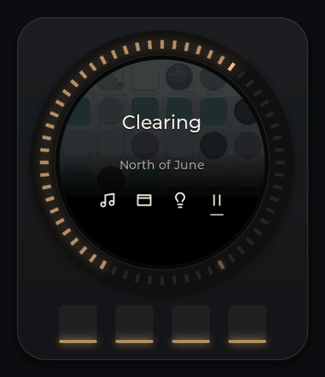
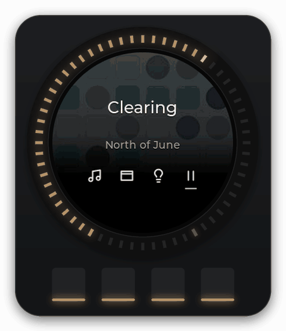
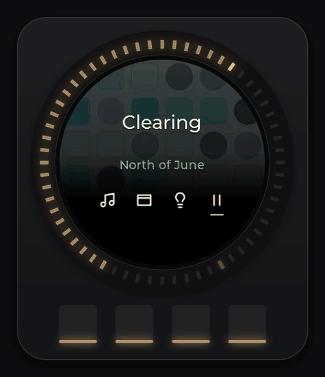
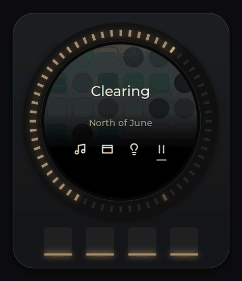

# Lights

Desk Dial drives the lights of one Home Assistant area from the knob. Turn for brightness or colour temperature, run a scene, switch the whole area off and back on. The knob's own screen tells you what it is doing; nothing on the PC needs to be open or in front.

Before this works you need Home Assistant set up in Settings: an address, a long-lived access token and an area. See the setup guide at [../setup/home-assistant.md](../setup/home-assistant.md).

A detent is one click of the knob. The buttons are button 1 to button 4, left to right.

## Opening Lights

From Home, tap 3. The screen shows the heading LIGHTS, the area's name, the current level (for example `62% · 2700 K`) and a ring whose colour follows the lights' colour temperature. Lights always opens in brightness mode.

<picture><source srcset="../media/lights-brightness.webp" type="image/webp"></picture>

## Buttons on the Lights screen

| Button | Tap | Hold |
| --- | --- | --- |
| 1 | Home | Home (the same) |
| 2 | Scenes | – |
| 3 | Switch the knob between brightness and colour temperature | – |
| 4 | All off, or Turn on when the lights are off | – |

Button 2 is dimmed when the area has no scenes ("No scenes set up"). Button 3 is dimmed when none of the lights can change colour temperature ("No colour temperature"). While a change is still being sent, button 4 is dimmed for a moment.

## Brightness

Each click is 1 %. The lowest level while on is 1 %; to go darker than that use All off. From off, the first click up turns the lights on at 1 %.

The knob feels heavier here than it does for music volume: a firmer click, and a wall at 0 and 100 (the knob stops, it never wraps around). While you turn, the screen switches to a big number with the caption "Brightness"; it drops back to the normal view about a second and a half after you stop.

A turn changes only the lights that are on, and sets them all to the same value. When every light is off, a turn switches all of the area's available lights on together.

## Colour temperature

Tap 3. The screen says "Knob: temperature" for a moment and the ring turns into a temperature gradient. Each click is 100 K. The range is 2200 K to 6500 K, narrowed to what your lights report they can do (a bulb that only goes 2700 K to 6500 K gets exactly that range, rounded to 100 K steps). The clicks are finer here, 36 per turn, again with walls at both ends.

Tap 3 again for "Knob: brightness".

<picture><source srcset="../media/lights-temperature.webp" type="image/webp"></picture>

## How changes reach your lights

Desk Dial sends at most four writes a second, and every write asks Home Assistant for a 0.4 second fade. The fades overlap, so a fast turn looks like one smooth dim rather than a staircase. The knob shows the value you set straight away; Home Assistant catches up within the fade.

If the lights change for another reason (a wall switch, the Home Assistant app, an automation), the knob follows: the value updates and the line "Changed in Home Assistant" shows for a moment. The knob does not fight back; it only sends what you turn.

## All off and Turn on

Tap 4 for All off. Before the lights go off, Desk Dial saves their current state into a scene in your Home Assistant named `scene.desk_dial_snapshot`, then turns the area off. The knob gives one soft pulse and the screen reads "Lights off / Tap 4 to turn on".

Tap 4 again for Turn on. When the saved snapshot covers exactly the area's current lights, Desk Dial restores it, so every light comes back at the level and colour it had. Otherwise it asks Home Assistant to turn the area on (Home Assistant then uses each light's last state). Turn on lands with a thump.

If the snapshot could not be saved, the lights still go off; a warning goes to the app's log. If the write itself fails, the screen says "Didn't change · try again".

<picture><source srcset="../media/lights-power.webp" type="image/webp"></picture>

## Scenes

Tap 2 on the Lights screen. The list holds the scenes, scripts and automations that belong to the area in Home Assistant, up to 20 of them. Turn to choose: the knob uses coarse clicks, 12 per turn, and the ring shows the list as a set of marks with the chosen one lit. Under the name you see `3 / 7 · 40% · 2700 K` when the scene's result is known, or `3 / 7 · running now` for the scene Desk Dial ran last.

| Button | Tap |
| --- | --- |
| 1 | Back to Lights |
| 2, 3 | Nothing ("Turn to choose · 4 runs it") |
| 4 | Run |

Run thumps as you press it. When Home Assistant confirms, the knob flashes green, the screen returns to Lights with the scene's name as its title and "Scene running" underneath, and a small toast on the PC reads "Lights · Evening". The scene's name stays as the title until you adjust the lights by hand; then the area's name comes back.

If the run fails the screen says "Didn't run · try again" and the toast reads "Couldn't run Evening".

<picture><source srcset="../media/lights-scenes.webp" type="image/webp"></picture>

## Brightness without leaving Home

On Home the knob normally sets music volume. Hold 4 for a second: the screen flashes "Knob sets brightness", the level line shows the area (`Studio · 62% · 2700 K`) and button 4 becomes All off or Turn on. Now a turn dims the room while the Home screen stays up. Hold 4 again for "Knob sets volume".

In this state the knob only does brightness; colour temperature needs the Lights screen.

## Several lights in the area

When the area holds more than one light, the Lights screen adds a line such as `Studio · 3 lights`. While the lights agree, the knob shows one value. When they differ (two on at 80 %, one at 30 %, or some on and some off), the caption becomes "Brightness · average" and the line reads `2 of 3 on`. A light that Home Assistant marks unavailable is named: `Desk lamp unavailable`, or `2 lights unavailable`. Lights you add to the area later are picked up without any change in Desk Dial.

The Navigator card on your monitor (see [desktop-companions.md](desktop-companions.md)) shows the same area under `Lights › Studio`, with a brightness bar and a temperature bar. It lists the lights one per row only when they differ or one is unavailable; while they match, the card stays compact.

## What the knob says when something is wrong

| On the knob | What it means |
| --- | --- |
| Not connected / Home Assistant / Open Settings on your PC | No Home Assistant address, the address cannot be reached, or the token was refused. Open Settings on the PC and use Test connection. |
| Connecting to lights… / Home Assistant | Desk Dial is still talking to Home Assistant. Wait a moment. |
| No lights in Studio / Add them in Home Assistant | The area exists but has no lights assigned to it. |
| Area not found / Pick the area in Settings | The area chosen in Settings no longer exists in Home Assistant. |
| Lights unavailable / Check them in Home Assistant | Every light in the area is unavailable (powered off at the wall, or offline). |
| Lights off / Tap 4 to turn on | All lights are off. Tap 4, or turn up for 1 %. |
| Changed in Home Assistant | Something other than the knob changed the lights; the knob now shows the new state. |
| Knob: temperature / Knob: brightness | You tapped 3; this is what the knob sets now. |
| Scene running | The scene ran. |
| Didn't run · try again / Didn't change · try again | Home Assistant did not accept the last call. |

On a blocked screen a turn is refused with a short deny glow and buttons 2 to 4 are dimmed, with the reason on the screen.

## Limits and known issues

- One area per Desk Dial. Changing it means Settings on the PC.
- Brightness and colour temperature only. Colour (hue), effects and per-light control are not on the knob.
- A turn sets every light that is on to the same value; you cannot dim one light of the area from the knob.
- The scene list is capped at 20 entries and includes scripts and automations assigned to the area as well as scenes.
- All off writes a scene named `scene.desk_dial_snapshot` into your Home Assistant and overwrites it each time. Delete it if you stop using Desk Dial.
- Over plain `http://` the access token crosses your network unencrypted; the app does not warn about this yet. A self-signed `https://` certificate is likely to be rejected.
- The knob polls Home Assistant every 2 seconds while Lights is open, on top of its live connection.
- Tested on one knob and one Home Assistant install (the author's).
