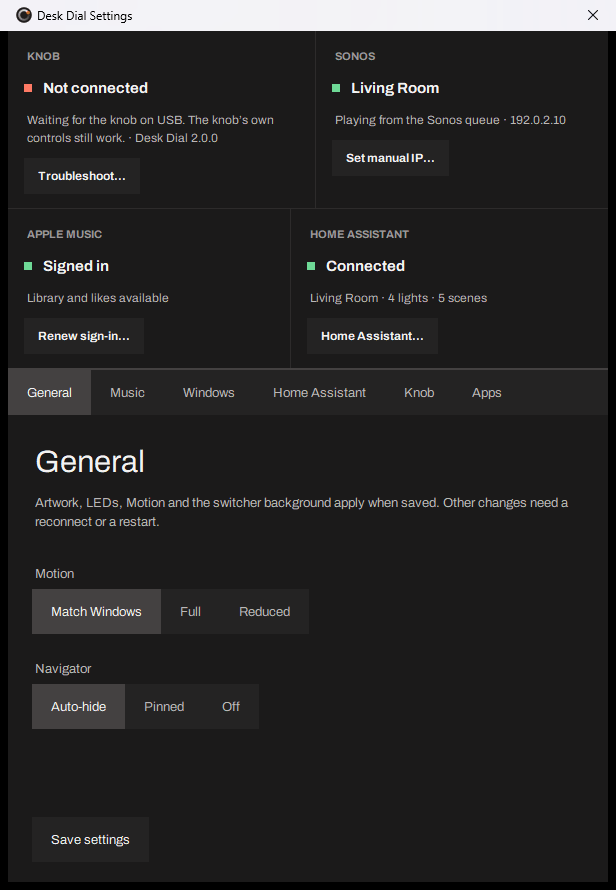
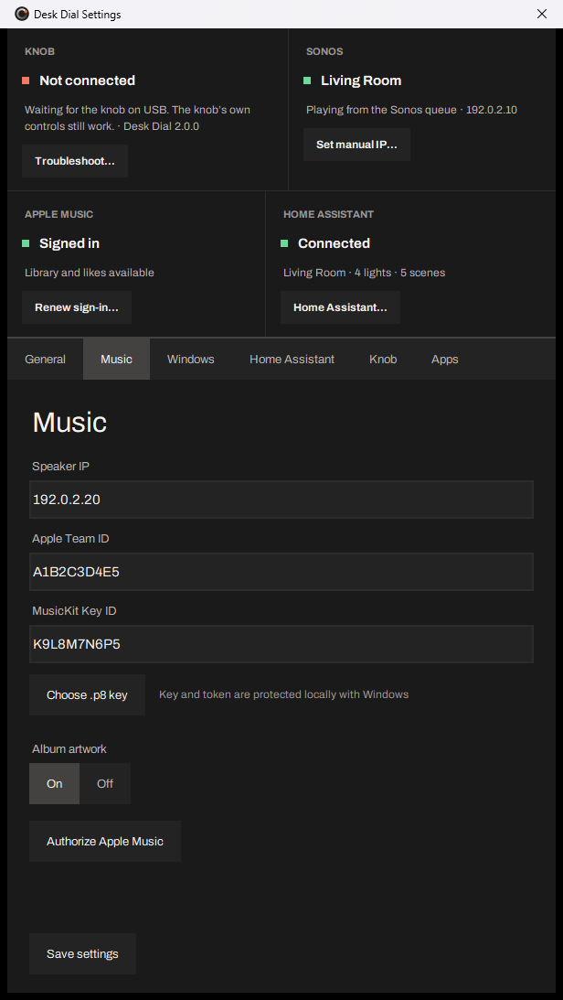
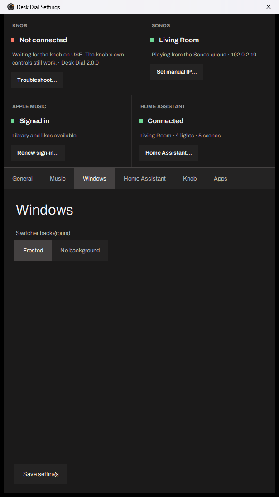
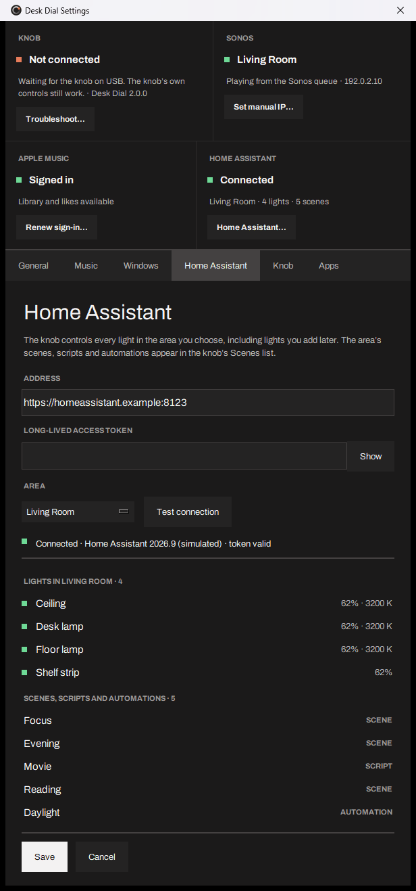
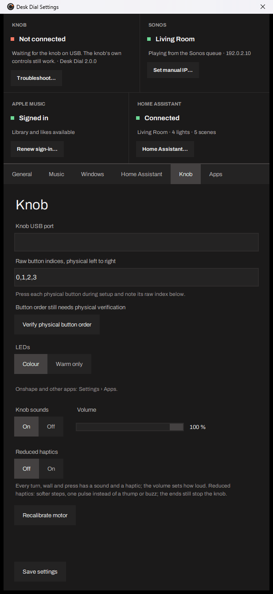
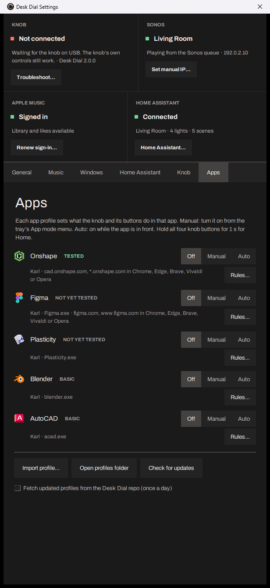

# Settings

Desk Dial lives in the Windows tray. Right-click its icon and choose Settings to open the Settings window; it also opens by itself on the first run. The window has six pages listed down the left side: General, Music, Windows, Home Assistant, Knob and Apps. Every page is described below with the labels exactly as the window shows them, what each option does and its default.

A note at the top of the General page tells you which changes apply straight away: album artwork, LEDs, Motion and the switcher background apply when saved; other changes need the knob to reconnect, or Desk Dial to be quit from the tray and opened again. The Save settings button sits at the bottom of the window and saves every page except Home Assistant, which has its own Save, and Apps, which applies each change at once.

Desk Dial is tested on one knob (the author's). This page describes Desk Dial v2.0.0.

The knob's own screens, each naming its four buttons:

## General

**Motion** · Match Windows / Full / Reduced · default Match Windows

How much the screens Desk Dial draws on the PC animate (the full-screen list, Up next, the window switcher). Match Windows follows the Animation effects switch in Windows Settings; Full always animates; Reduced keeps motion to a minimum.

**Navigator** · Auto-hide / Pinned / Off · default Auto-hide

The Navigator is the small glass card at the left edge of your main monitor that shows where the knob is: the current screen, the four button words and the hold actions. It never takes focus and clicks pass through it. Auto-hide shows it when you touch the knob and hides it 4 seconds after your last input (20 seconds in a list). Pinned keeps it on screen. Off never shows it. It is hidden while the full-screen list, Up next, the window switcher or Onshape mode is open.

## Music

**Speaker IP** · a text field · default a placeholder address

The IPv4 address of one Sonos speaker on your network, for example 192.0.2.20. You find it in the Sonos app under the speaker's About settings. Desk Dial controls the group that speaker belongs to. There is no discovery: the address has to be typed. A changed address takes effect after you quit Desk Dial from the tray and open it again.

**Apple Team ID** · a text field

Your Apple Developer Team ID (ten characters), from your Apple Developer account page.

**MusicKit Key ID** · a text field

The Key ID of the MusicKit private key you created in your Apple Developer account.

**Choose .p8 key** · a button

Opens a file picker for the `.p8` private key file Apple gave you when you created the MusicKit key. The key text is stored encrypted on this PC (see Where settings are stored); the file itself is not copied. The line next to the button reminds you: "Key and token are protected locally with Windows".

**Album artwork** · On / Off · default On

Whether covers are sent to the knob's screen and drawn on the LED ring. Off shows names only. Applies when saved.

**Authorize Apple Music** · a button

Opens a page on your own PC (127.0.0.1) in your browser. The page loads Apple's MusicKit script and asks you to sign in to Apple Music and allow Desk Dial to read your library. The resulting user token comes back to Desk Dial only and is stored encrypted. Repeat this when the knob says "Sign-in expired".

Apple Music needs an Apple Developer Program membership (paid yearly), a MusicKit key, and an Apple Music subscription. Without them, Sonos volume, Play / Pause, Tracks, Seek and Up next still work; Recently Added, Playlists, Play next and Like do not. See [Music](music.md#what-needs-what).

## Windows

**Switcher background** · Frosted / No background · default Frosted

The backdrop of the window switcher that opens from Home button 2. Frosted blurs the whole screen behind the window cards; No background shows the cards over your desktop as it is. On a PC whose window mode does not allow No background, only Frosted is offered and a note says so. Applies when saved.

## Home Assistant

This page has its own Save and Cancel buttons. The intro reads: the knob controls every light in the area you choose, including lights you add later; the area's scenes, scripts and automations appear in the knob's Scenes list.

**Address** · a text field · hint http://homeassistant.local:8123

Where your Home Assistant is reached: `http://` or `https://`, the host, an optional port and an optional path prefix.

**Long-lived access token** · a text field, hidden as dots, with a Show button

A long-lived access token from your Home Assistant profile (Profile › Security › Long-lived access tokens). Once saved, the caption reads "Long-lived access token · saved (leave empty to keep it)" and you only type a new one to replace it. It is stored encrypted and never logged.

**Area** · a drop-down list

The Home Assistant area whose lights the knob drives, shown as "Area name · 3 lights". The list fills after Test connection succeeds.

**Test connection** · a button

Connects with the address and token above and lists the areas. While it runs the button reads "Testing…". Results are shown on the line below: "Connected"; "Token rejected (401). Create a long-lived access token in your Home Assistant profile."; "Can’t reach Home Assistant on this network."; "Area not found"; "No lights in Area"; "Lights unavailable"; or "Not tested since the last change" after you edit a field.

Under the status, the page lists the lights of the chosen area with an on / off / unavailable dot each, and the scenes, scripts and automations the knob's Scenes list will offer (up to 20).

Over plain `http://` the token crosses your network unencrypted, and a line under the address says so: "The token travels unencrypted on your network; use https:// if Home Assistant has a certificate." A self-signed `https://` certificate will most likely be rejected, because certificate checking is on.

## Knob

**Knob USB port** · a text field

The serial port of the knob (for example COM8). Desk Dial finds the knob by its USB identity and fills this in itself when it connects; you normally never edit it.

**Raw button indices, physical left to right** · a text field, with **Verify physical button order**

Maps the knob's four buttons to buttons 1 to 4. Press Verify physical button order, then press each button on the knob from left to right; the line below counts "Recorded 1 of 4 · press the next button to its right" until "All four recorded left to right · Save settings to apply". Until verified it reads "Button order still needs physical verification". Applies when the knob reconnects.

**LEDs** · Colour / Warm only · default Colour

Colour lets the LED ring use cover colours, the amber and red volume warning and the coloured moments (a pink bloom on Like, a half-ring wash on Snap). Warm only keeps every LED in the warm resting colour. Applies when saved.

**Onshape** · a note only: "Onshape and other apps: Settings › Apps." Onshape mode moved to the [Apps](#apps) page in v2.0.0; your earlier choice carries over.

**Knob sounds** · On / Off · default On, with **Volume** · a slider 0 to 100 % in steps of 5 · default 100 %

The clicks the knob's speaker plays with its detents. Both apply the moment you change them (the slider when you release it) and are saved at once. Every turn, wall and press has its sound; Reduced haptics keeps the sounds of presses and landings but silences the clicks.

**Reduced haptics** · Off / On · default Off

On makes the steps softer and the clicks silent, and replaces a thump or buzz with one soft pulse. The walls at the ends of a range still stop the knob. Saved with Save settings; the knob takes it with the next screen it is sent.

**Recalibrate motor** · a button

Aligns the knob's motor again; takes about 10 seconds, during which you keep your hands off the knob and its screens come back when done. If the previous run reported that the motor's direction changed, pressing it again accepts the new direction. Not yet tested on real hardware.

## Apps

One row per app (Onshape, Figma, Plasticity, Blender, AutoCAD), each **Off / Manual / Auto**, with its status, where its profile came from and a **Rules…** button; plus **Import profile…**, **Open profiles folder**, **Check for updates** and the box **Fetch updated profiles from the Desk Dial repo (once a day)** (off by default). Every change applies at once. Everything on this page is described on [Apps](apps.md).

## Where settings are stored

Everything lives under `%LOCALAPPDATA%\DeskDial` (for example `C:\Users\you\AppData\Local\DeskDial`):

| File | What it holds |
| --- | --- |
| `data\settings.json` | Plain JSON: the speaker address, the Home Assistant address and area, button order, every option above. Never a token or key. |
| `data\credentials.bin` | Encrypted with Windows DPAPI for your Windows user: the MusicKit `.p8` key text, the Apple Music user token, the Home Assistant token. |
| `data\queue-ledger.json` | What Desk Dial has queued on Sonos, so Shuffle off can restore the order. |
| `queue-recovery.bin`, `shuffle-restore.bin` | Encrypted queue restore records. |
| `logs\app.log` (and `.1` to `.3`) | The app log, 1 MB each. |
| `logs\crash.log` | Written if the app crashes. |
| `logs\status.json` | Rewritten every second: the knob's state, the exe and data paths (which include your Windows user name), the Home Assistant area and light ids. Never tokens. |
| `backups\control-center-inventory-*.json` | One file per knob connection with the knob's profiles and serial number. Never pruned. |

To remove everything, quit Desk Dial from the tray and delete the folder.

## Advanced: settings.json keys without a UI

These are plain keys in `data\settings.json`. Edit the file while Desk Dial is not running; a wrong value falls back to the default.

- `onshape_idle_ms` · default 800 · range 200 to 5000. In Onshape mode, how long after the last knob click a held orbit, tilt or pan drag is released. Lower is snappier, higher tolerates slower turning.
- `onshape_content_classes` · default `["Chrome_RenderWidgetHostHWND"]`. The window classes Desk Dial treats as the browser's page content when deciding whether the pointer is over the Onshape model. Change it only if a browser build renames its content window.
- `upnext_button3` · `"like"` or `"playnext"`. The code can make button 3 in Up next a Play next button instead of Like. In Desk Dial v2.0.0 the value is fixed to Like inside the app and the key is not yet read from settings.json; it is listed so you know what the name means when it appears.
- `led_drive`, `led_dither`, `led_pink`, `led_vol_full` · tuning values for the LED ring, kept exactly as written when present. For hands-on tuning only; leave them out.

## Limits and known issues

- Most changes need a reconnect or a restart; only album artwork, LEDs, Motion, the switcher background and Knob sounds apply at once.
- No speaker discovery: the Sonos address is typed by hand, and a changed address needs a restart.
- The speaker field is still labelled with the author's room name.
- The Home Assistant token travels unencrypted over `http://`; Settings warns about it but still allows it.
- Recalibrate motor is not yet tested on real hardware.
- No installer, no auto-start and no uninstaller ship today; see the README for the manual steps.
