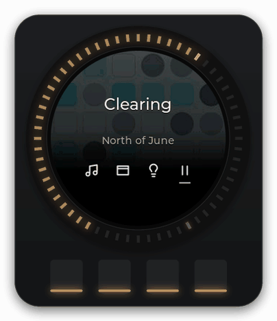

# Set up Sonos

Desk Dial turns the knob into a volume dial and transport control for one Sonos speaker, or for the group that speaker is part of. Setup is one field: the speaker's IP address. Nothing is installed on the speaker and nothing changes in your Sonos app.

Tested on one knob (the author's) with one Sonos household. Version v2.0.0.

<picture><source srcset="../media/music-volume.webp" type="image/webp"></picture>

## What you need

- A Sonos speaker on the same local network as your PC.
- Its IP address (the next step shows where to find it).
- Desk Dial running with the knob connected. See [the flashing guide](../flashing.md) if the knob still has the stock firmware.

Apple Music is separate. The volume dial, play/pause and skip work without it. Recently Added, Playlists, Play, Play next and Like need the Apple Music setup.

## Step 1: find the speaker's IP address

In the Sonos app, open Settings, then System, then About My System. Each speaker is listed with its IP address, for example `192.0.2.45`. If the speaker is part of a group, any speaker in that group will do, but pick the main speaker of a stereo pair or home-theatre set (the one the Sonos app names), not its partner or Sub.

If you cannot find it there, your router's list of connected devices shows the same address next to the speaker's name.

Desk Dial does not search the network for speakers. You type the address yourself.

## Step 2: type it in Settings

1. Right-click the Desk Dial icon in the tray and open Settings. (The first run opens Settings on its own.)
2. Choose the Music page from the list on the left.
3. Type the address in the speaker IP field at the top. It must be a valid IP address; otherwise Save refuses with "Enter a valid speaker IP and each index 0, 1, 2, 3 once."
4. Click Save.

Once the speaker answers, Desk Dial remembers which room it is, and forgets that room as soon as you change the address, so the new speaker's room is learned instead. A speaker change does not take effect straight away. The note under Save says so: quit Desk Dial from the tray and open it again. After that, the new speaker is used.

Your speaker IP is kept in plain text in `%LOCALAPPDATA%\DeskDial\data\settings.json`. No password or account is needed for Sonos, so none is stored.

## Step 3: check it works

**In Settings.** The strip across the top of the Settings window has a Sonos column. Once a second Desk Dial asks the speaker what it is doing, so within a second or two the column should read the speaker's room name (for example "Kitchen") with a line under it saying what is playing and the IP address you typed. If it reads "Not found" with "Can't reach Sonos on this network", check the address and that the PC and speaker are on the same network.

**On the knob.** The Home screen shows VOLUME with the current group volume. Turn the knob: the number follows and the speaker gets louder or quieter, one step per click (a click is one detent of the knob), with a firm stop at 0 and at 100. Tap button 4 to play or pause.

While Desk Dial cannot reach the speaker, the knob shows "Looking for Sonos…" and then "Sonos unavailable", with "Windows still works" underneath. The window picker and Lights keep working.

## Which speakers the knob controls

The knob controls the **group** the chosen speaker belongs to, exactly as the Sonos app groups it:

- Volume is the group volume, so every speaker in the group moves together.
- Play, pause, skip and the queue go to the group's lead speaker (the one that is actually playing).
- A speaker that is playing on its own is a group of one.

If you have several groups, only the chosen speaker's group follows the knob. To control another room, change the groups in the Sonos app, or type that room's address in Settings and restart Desk Dial.

Regrouping is picked up automatically. Desk Dial re-reads the group every second, so if you group or ungroup speakers in the Sonos app the knob follows within a second. If the group changes in the very moment you press something, the knob says "Speaker group changed" and drops that one action rather than applying it to the wrong speakers.

If you typed the address of a stereo partner or a Sub, Desk Dial asks for the main speaker instead ("Select the primary room speaker, not its bonded satellite or Sub").

## Firewall

Nothing to open. Desk Dial only makes outgoing connections to the speaker and asks it for its state once a second; it does not listen for messages from the speaker, so no inbound port is needed and Windows Firewall does not have to be told anything.

## Limits and known issues

- There is no speaker discovery. You must find and type the address yourself, and if your router hands the speaker a new address the knob stops working until you update Settings.
- A speaker change needs a restart of Desk Dial (quit from the tray, open again).
- One speaker group at a time. Other groups are not shown and cannot be chosen from the knob.
- The volume is confirmed by reading it back from the speaker. On a slow network a turn may be refused with "The requested volume was not confirmed"; turn again.
- Radio, AirPlay and line-in sources show on the knob but have no queue, so Tracks, Up next and Seek are not offered for them.
